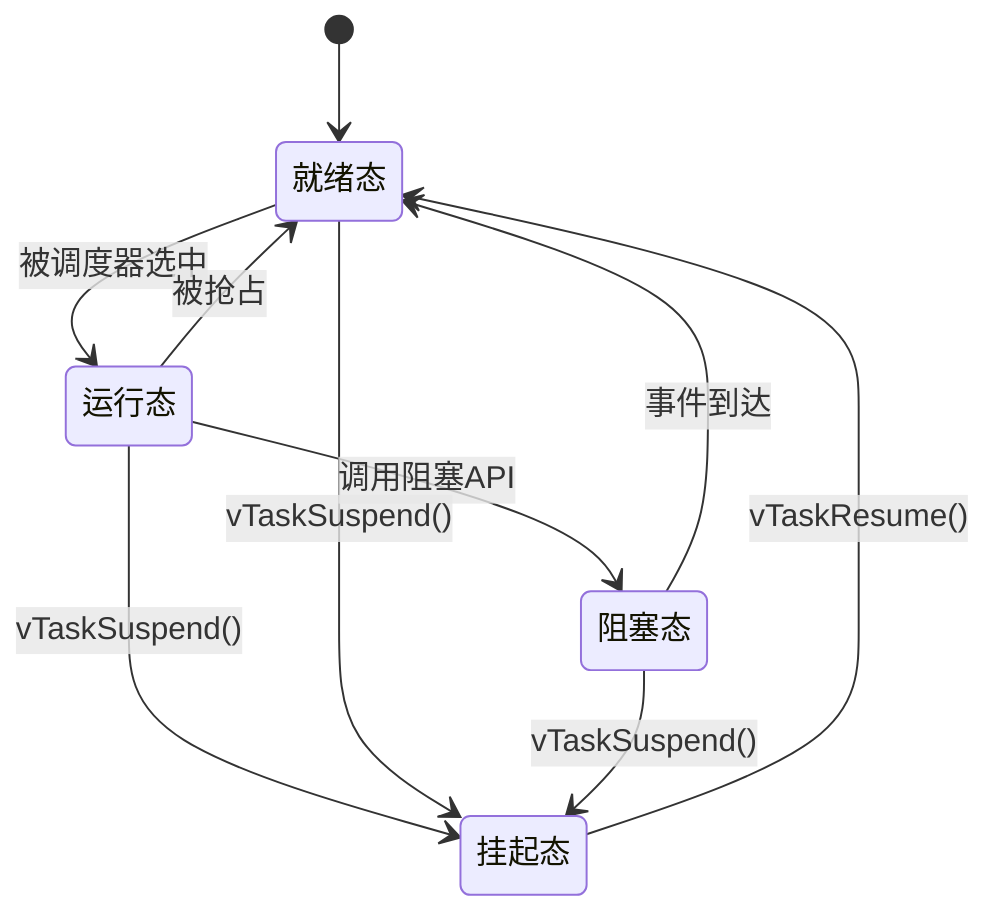

# 1 嵌入式八股文

---

## 1.1 一、通信协议

### 1.1.1 RS 232 和 RS 485 的区别是什么？

RS-232 是在早期进行串行通信时，由于数据干扰过强而推出的一种协议，它本身搭配一个电平转换器。早期在创新通信时，我们设置 2.4 V 及以上为高电平，0.4 V 以下为低电平（标准 TTL 电平为 0 V 低、5 V 高）。但由于 0.4 V 到 2.4 V 之间的容差非常小，静电可能导致低电平被误判为高电平。

因此我们使用 RS-232。RS-232 的电平转换器会将 0/1 信号的高电平转为 +12 V，低电平转为 -12 V（具体极性可能说反，但不影响理解）。其最终目的是扩大 0/1 电平之间的容错范围。由于差值变为 24 V，容差达到 20 V 以上，因此较难被误判。

RS 485 更加优秀，因为它使用双绞线，并将两根线进行差分处理。简单来说，可以理解为 A 接口和 B 接口：A 接口输出与原始信号相同的电平，B 接口输出相反的电平。计算 A 和 B 之间的差值，只要差值大于 0 就是正信号（即 1），小于 0 就是负信号（即 0）。利用这种差模信号的好处在于，即便干扰同时作用于双绞线的两根线，也不会影响它们的差值。因此，RS 485 的抗干扰能力极强。

RS 485 相比 RS 232 更优秀的点在于：
1. 传输距离长：RS 485 的传输距离可达数千米，而 RS 232 的距离大概只有 20 米。
2. 抗干扰性更强：RS 485 利用双绞线传输差模信号，而 RS 232 只是增大了容差，并不能完全滤过干扰。
3. 信号输出方式不同：RS 485 利用差模信号输出，而 RS 232 输出的是普通转换电平。
4. 通信方式：RS232为点对点通信，仅支持一对一传输；RS485为多点总线通信，单总线可接多设备
5. 引脚与速率：RS232引脚多、速率低；RS485引脚少、传输速率可调，工业应用更广泛

### 1.1.2 处理器与外部设备通信的两种方式

1. 从实时性来讲：同步和异步
2. 从传输通道来讲：串行和并行

1. 并行通信：数据各位同步传输，传输速度快，但占用IO引脚资源多，抗干扰能力弱，仅适用于短距离通信；
2. 串行通信：数据按位顺序传输，占用引脚资源少，抗干扰能力强，传输距离远，速度相对较慢，是嵌入式设备主流通信方式

### 1.1.3 串行通信的通信方式分类

1. 按时钟同步分类：
   2. 同步通信：SPI、I2C
   3. 异步通信：UART、单总线
4. 按数据传输方向分类：
   5. 单工
   6. 半双工
   7. 全双工

### 1.1.4 通信方式分类（常见协议总览）

1. UART
2. SPI
3. I2C
4. CAN 总线通信
5. LIN 通信
6. RS 485
7. RS 232
8. Modbus
9. USB
10. 以太网
11. 蓝牙
12. MQTT

---

## 1.2 二、C/C++ 语言

### 1.2.1 Static 的用法有几种？

1. 修饰局部变量，将局部变量的生命周期从"函数调用期间"延长到"整个程序运行期间"。变量只初始化一次，函数多次调用间保持值。
2. 全局写一个 static 变量，将全局变量的链接属性从"外部链接（external linkage）"改为"内部链接（internal linkage）"，即该变量**只能在本文件内使用**，其他文件即使 `extern` 声明也无法访问。
3. 修饰函数，与修饰全局变量类似，将函数的链接属性改为内部链接，限制该函数只能在本翻译单元（.c 文件）内被调用，避免命名冲突。

对，核心语义一脉相承——**"脱离个体，绑定到更大的作用域"**。C++ 中 `static` 总共有以下 **四种用法**：

---

#### 1.2.1.1 静态局部变量（继承自 C）

```cpp
void foo() {
    static int count = 0;  // 只初始化一次，生命周期贯穿整个程序
    count++;
}
```

- 存储在数据段/BSS段，不在栈上
- 作用域仅限函数内部，但值在多次调用间保持

---

#### 1.2.1.2 静态全局变量 / 静态函数（继承自 C）

```cpp
static int fileScopedVar = 10;      // 仅本文件可见
static void helper() { ... }        // 仅本文件可调用
```

- 限制链接属性为**内部链接**，防止跨文件冲突
- 本质是"把这个东西锁在当前翻译单元里"

---

#### 1.2.1.3 类的静态成员变量（C++ 新增）

```cpp
class Widget {
    static int total;  // 所有对象共享一份
};
int Widget::total = 0;  // 类外定义
```

- 属于类，不属于任何对象
- 所有实例共享同一份数据

---

#### 1.2.1.4 类的静态成员函数（C++ 新增）

```cpp
class Widget {
public:
    static int getTotal() { return total; }  // 无 this 指针
private:
    static int total;
};
```

- 属于类，无需实例化即可调用：`Widget::getTotal()`
- 没有 `this`，只能访问静态成员

---

#### 1.2.1.5 📌 统一理解

|用法|"脱离"了什么|"绑定"到了什么|
|---|---|---|
|静态局部变量|脱离了栈（函数调用周期）|绑定到程序生命周期|
|静态全局变量/函数|脱离了外部链接|绑定到当前翻译单元|
|静态成员变量|脱离了对象实例|绑定到类|
|静态成员函数|脱离了对象实例（无 this）|绑定到类|

> 一句话总结：**`static` 的本质就是"提升归属层级"**——从函数调用提升到程序生命周期，从跨文件提升到文件内部，从对象实例提升到类本身。

### 1.2.2 static 变量存储的位置？

存储在数据段（对于初始化的静态变量）或 bss 段（对于未初始化的静态变量）。

---

## 1.3 三、RTOS

### 1.3.1 RTOS 采用哪些手段来保证它的实时性？

RTOS 的任务系统允许任务抢占以及相同优先级任务之间的时间片轮转：
1. 固定优先级调度或抢占式调度；
   这是 RTOS 实时性的核心机制。高优先级任务一旦就绪，可以立即抢占低优先级任务，确保关键任务在最短时间内得到响应。
2. 最小化中断禁用时间；
   中断禁用期间系统无法响应外部事件，RTOS 通过精细化的临界区管理（如仅保护关键数据结构）来缩短禁用窗口。
3. 提供时间确定性的API；
   RTOS 的内核服务（如信号量、消息队列等）的执行时间是有上界的，不会出现不可预测的阻塞。
4. 使用实时时钟和定时器；
   用于实现精确的延时、周期性任务调度和超时机制。
5. 优化上下文切换时间
   上下文切换越快，调度延迟越小，实时性越好。
通过这些手段保证它的实时性。

### 1.3.2 RTOS 何时会线程调度

1. 在一个线程执行完毕
2. 主动让出 CPU (sleep 或者 yield 结束)
3. 当一个更高优先级的任务变成**就绪态**的时候
4. 定时器到期
5. 外部中断结束之后

### 1.3.3 FreeRTOS 中如何创建任务？xTaskCreate() 需要传递哪些参数？

**难度**：简单 ｜ **来源**：影石Insta360 ｜ **分类**：嵌入式基础面试题 / RTOS

使用 `xTaskCreate()` 创建任务，需要传递以下参数：

1. **任务函数指针**：任务要执行的函数入口
2. **任务名**：仅用于调试，方便追踪任务
3. **栈大小**：单位是**字（word）**，非字节
4. **传给任务的参数**：任务函数可通过入参接收
5. **优先级**：数值越大优先级越高（视配置而定）
6. **任务句柄**：用于后续操作该任务（挂起、删除等）

注意事项：

- **任务函数不能返回**，内部必须有无限循环，或调用 `vTaskDelete(NULL)` 删除自己。
- **栈大小**要根据局部变量大小和调用深度合理设置，过小会栈溢出，过大浪费 RAM。

### 1.3.4 FreeRTOS 中信号量和互斥量的区别是什么？为什么互斥锁能解决优先级反转问题？

**难度**：中等 ｜ **来源**：小鹏汽车 ｜ **分类**：RTOS

**信号量（Semaphore）**用于同步 / 事件通知：
- **无所有者**，任何任务 / ISR 都能释放
- 侧重于"通知事件发生"

**互斥量（Mutex）**用于互斥访问共享资源：
- **有所有者**，谁拿谁放（获取者才能释放）
- 侧重于"保护临界区"

> 关键区别：**Mutex 支持优先级继承，Semaphore 不支持**。

**Mutex 能解决优先级反转的原因**：当高优先级任务等待互斥量时，持有该 Mutex 的低优先级任务会被**临时提升优先级**，从而不被中优先级任务抢占，尽快释放资源。Semaphore 没有"谁持有"的信息，无法实现该机制。

> 经验总结：**互斥用 Mutex，同步用 Semaphore**。

### 1.3.5 FreeRTOS 中的任务通知（Task Notification）是什么？它和队列、信号量相比有什么优缺点？

**难度**：中等 ｜ **来源**：全志科技 ｜ **分类**：RTOS

**任务通知**是 FreeRTOS 最轻量级的任务间通信机制，每个任务自带一个 **32 位通知值**。

基本用法：
- `xTaskNotifyGive()`：发送通知
- `ulTaskNotifyTake()`：接收通知（带超时）

与队列 / 信号量相比：

| 对比项 | 任务通知 | 队列 / 信号量 |
|---|---|---|
| **速度** | 快（约快 45%） | 较慢 |
| **内存开销** | 零开销（复用任务自带 32 位值） | 需额外分配内存 |
| **通信方式** | 只能**一对一**，不能广播 | 可多对多 / 广播 |

适用场景：
- ISR 通知特定任务
- 简单二值同步
- 轻量计数信号量的替代方案

### 1.3.6 FreeRTOS 的任务有哪些状态？状态之间如何切换？

**难度**：中等 ｜ **来源**：小鹏汽车 ｜ **分类**：RTOS

FreeRTOS 任务有**四种状态**：

| 状态 | 含义 |
|---|---|
| **运行态（Running）** | 正在执行 |
| **就绪态（Ready）** | 等待调度 |
| **阻塞态（Blocked）** | 等待事件 |
| **挂起态（Suspended）** | 被 `vTaskSuspend()` 挂起 |

**状态转移**：
- 就绪 → 运行：被调度器选中
- 运行 → 就绪：被更高优先级任务抢占
- 运行 → 阻塞：调用阻塞 API（如等待信号量 / 队列）
- 阻塞 → 就绪：事件到达
- 任意状态 → 挂起：调用 `vTaskSuspend()`
- 挂起 → 就绪：调用 `vTaskResume()`



> 核心：调度器总是运行**就绪态中优先级最高**的任务。

### 1.3.7 FreeRTOS 的任务调度机制是什么？

**难度**：中等 ｜ **来源**：大疆 ｜ **分类**：RTOS

- FreeRTOS 默认是**基于优先级的抢占式调度**：高优先级任务一旦就绪，立刻抢占低优先级任务。
- 同优先级之间可以开启**时间片轮转**，大家轮流执行。
- **调度触发的时机**主要有：
  1. 任务主动阻塞（等信号量 / 队列）
  2. 时间片耗尽
  3. 更高优先级任务被唤醒
  4. 中断退出时
- 核心原则：**始终让就绪态中优先级最高的任务跑**。
- 也可以通过配置 `configUSE_PREEMPTION = 0` 切换成**协作式调度**，但实际项目里很少这么用。

### 1.3.8 RTOS 中的中断服务函数（ISR）有什么限制？为什么不能在 ISR 中调用阻塞型 API？

**难度**：中等 ｜ **来源**：芯动科技 ｜ **分类**：RTOS

ISR 中**不能调用阻塞型 API**，原因：

- ISR 运行在**中断上下文**，**没有关联的 TCB**（任务控制块）。
- 阻塞意味着要挂起"当前任务"，但 ISR **不是任务**，调度器无法处理。

**正确做法**：ISR 中使用 **`FromISR` 后缀 API**（如 `xQueueSendFromISR`、`xSemaphoreGiveFromISR`），这些版本**绝不阻塞**，失败就返回错误。

### 1.3.9 FreeRTOS 的 tickless 模式是什么？它如何实现低功耗？

**难度**：困难 ｜ **来源**：禾赛科技 ｜ **分类**：RTOS

**Tickless 模式**是 FreeRTOS 的**低功耗特性**。正常 `SysTick` 每 1ms 中断一次，空闲时白白唤醒 CPU 浪费电。

**Tickless 原理**：
1. 所有任务都阻塞时，计算**下一个唤醒时间**。
2. 将 `SysTick` **拉长到那个时间点**，CPU 进入**低功耗模式（WFI）**。
3. 唤醒后**补偿跳过的 tick 计数**。

配置：`configUSE_TICKLESS_IDLE = 1`。

> 效果：空闲时功耗可降低几个数量级，适合**电池供电的 IoT 设备**。

### 1.3.10 什么是优先级反转？FreeRTOS 中如何通过优先级继承机制解决？

**难度**：困难 ｜ **来源**：小鹏汽车 ｜ **分类**：RTOS

**优先级反转场景**：L 持锁 → H 需要锁被阻塞 → M 抢占 L → H 被 M 间接阻塞。

**优先级继承机制**：
1. H 等待时，FreeRTOS 自动将 L 的优先级**提升到 H 的级别**
2. L 因此**不被 M 抢占**，得以跑完
3. L 释放锁 → L 恢复原优先级 → H 获得锁

注意事项：
- 只有 `xSemaphoreCreateMutex()` 支持**优先级继承**，**二值信号量不支持**。
- 优先级继承只是**缓解措施**，**多层嵌套锁**时可能仍会有问题。

---

## 1.4 四、MCU 与硬件

### 1.4.1 DMA有什么作用？应用场景有哪些？

DMA（直接内存访问）的核心作用是实现外设与内存、内存与内存之间的数据直接传输，全程无需 CPU 参与。

DMA 与 CPU 的关系，类似于脊髓与大脑的关系。大脑的运算负荷很重，控制着人体几乎一切行为；为了减轻大脑的负荷，脊髓发育出了一些类似"条件反射"的行为，无需大脑参与。

同理，DMA 就像机器的"条件反射"，其数据传输行为无需 CPU 参与。
所以 DMA 的优势在于：
1. 解放 CPU
2. 数据传输速率快
3. 提升系统实时性
4. 降低系统整体功耗

### 1.4.2 STM 32 的定时器相关配置与运行流程

1. 定时器时钟使能
2. 定时器配置
3. 中断配置
4. 启动定时器
5. 中断处理

### 1.4.3 STM 32 的 8 种 GPIO 模式分别是什么？

分别是浮空输入、上拉输入、下拉输入、模拟输入，然后推挽输出、开漏输出、复用推挽和复用开漏。

### 1.4.4 单片机定时器的作用和优势是什么？

**单片机定时器**是硬件计数器，由时钟驱动自动计数。

作用：
- **精确定时**：产生固定时间间隔的中断
- **PWM输出**：控制电机、LED亮度
- **输入捕获**：测量外部信号频率/脉宽
- **编码器接口**：读取旋转编码器

优势（相比软件延时）：
- **不占CPU**：硬件自动计数，CPU可以做其他事
- **精度高**：不受代码执行时间影响
- **可中断**：定时到了自动触发中断

举个例子：用定时器产生1ms中断做系统心跳，同时输出PWM控制电机。

### 1.4.5 STM32的启动模式有哪几种？如何选择？

STM32**启动模式**（以STM32F4为例）：

通过BOOT0/BOOT1引脚选择：
- **BOOT0=0**：从**Flash**启动（正常运行模式，最常用）
- **BOOT0=1, BOOT1=0**：从**系统存储器**启动（内置Bootloader，用于串口/USB下载）
- **BOOT0=1, BOOT1=1**：从**SRAM**启动（调试用）

选择原则：
- 正常产品：BOOT0接地（Flash启动）
- 开发调试：可切换到系统存储器用串口烧录
- 自定义Bootloader：Flash中先运行Bootloader，再跳转到APP

### 1.4.6 堆和栈的区别是什么？STM32的内存模型是怎样的？

**栈**：编译器自动管理，存局部变量，从高地址向低增长，速度快但空间有限。**堆**：手动管理（malloc/free），从低地址向高增长，空间较大但有碎片。

**STM32内存模型**（地址从低到高）：
- **Flash（0x08000000）**：代码（.text）和只读数据（.rodata）
- **SRAM（0x20000000）**：.data段 → .bss段 → 堆（向上）→ 空闲 → 栈（从顶部向下）

堆和栈相向增长，重叠则溢出。

### 1.4.7 STM 32 的 Flash 和 RAM 大小分别是多少？CPU 主频是多少？

这个取决于具体型号，以常用的为例：
- **STM32F103C8T6**（蓝色药丸）：Flash 64KB，RAM 20KB，主频72MHz
- **STM32F103ZET6**：Flash 512KB，RAM 64KB，主频72MHz
- **STM32F407**：Flash 1MB，RAM 192KB，主频168MHz
- **STM32H743**：Flash 2MB，RAM 1MB，主频480MHz

面试时通常说自己用过的具体型号就行。记住一个大致规律：**F1系列72MHz，F4系列168MHz，H7系列480MHz**，Flash从64KB到2MB不等，RAM从20KB到1MB不等。

### 1.4.8 STM32启动过程是什么？

一、处理器复位
二、向量表复位
三、系统初始化
四、C 库初始化
五、启动主函数

---

## 1.5 五、调试与工具

### 1.5.1 有哪些常用的调试方法？

1. 串口调试
2. JTAG 调试
3. LED 灯调试
4. 硬件逻辑分析仪
5. 断点和单点调试
6. 内存调试
7. 示波器
8. 看门狗调试
9. GDB 调试

---

## 1.6 收件箱（待分类）

> **用法：** 新题目直接追加在这个区域下面，用 `###` 开头写题目标题，然后写答案内容。完成后跟我说一声，我来帮你归类到上面的大类中。


### 1.6.1 volatile变量作用 ？
防止编译器对变量进行优化，相当于告诉系统某些变量随时可能改变。因为我们的寄存器可以从外部（如外部中断）改变，不像纯软件代码那样变化可预知。对于传感器中断，其变化是不可预知的，所以我们必须开启这个选项。

### 1.6.2 串口发送一个字节多少位？
一般情况下发送一个字节需要10位：1个起始位、8个数据位和1个停止位。但具体可能因配置不同而有所变化

### 1.6.3 线程优先级反转是什么，如何解决？
线程优先级反转：

在正常情况下，高优先级任务一定是最先执行的。

但有可能出现高优先级和低优先级程序同时竞争一个互斥量的情况。例如，低优先级程序拿到了互斥量并正在运行，此时高优先级程序也需要该互斥量，但由于互斥量尚未被释放，高优先级程序被迫等待。

如果此时中优先级任务突然唤醒，由于它的优先级高于低优先级任务，它会抢占 CPU。如果中优先级任务中存在 Bug 导致其一直执行，那么中优先级任务反而比高优先级任务更能占用 CPU，这种现象就叫做优先级反转。

如何解决呢？关键在于使用优先级继承机制：当一个高优先级任务向低优先级任务获取变量服务时，该低优先级任务的优先级会临时提升为高优先级。

#### 1.6.3.1 标准答案
线程优先级反转是指低优先级的线程持有某个资源，而高优先级的线程正在等待这个资源，导致中等优先级的线程抢占CPU时间，阻碍高优先级线程执行。解决方式：优先级继承——当高优先级线程等待低优先级线程释放资源时，低优先级线程会暂时"继承"高优先级的优先级；优先级上限——设置mutex或资源的优先级上限，确保只有在这个优先级以下的线程可以锁定资源

### 1.6.4 51和32架构的区别？
51微控制器通常基于8位架构，而32微控制器（如STM32）基于32位ARM架构。32位架构处理能力强，更适合处理复杂的计算任务。32位架构通常具有更多的内存和存储空间

### 1.6.5 STM 32 处理中断的过程是怎么样的？
STM32的中断开始于NVIC（嵌套向量中断控制器）。当外部/内部事件触发时，NVIC会识别中断源并根据其优先级将控制权转移到相应的中断服务程序

### 1.6.6 UART串口通信相关内容？
Uart 是全双工异步串行通信，通过 TXD 发送、RXD 接收，需收发双方配置以下参数：
- 波特率
- 数据位
- 校验位
- 停止位

配置步骤如下：
1. 使能串口和 GPIO 时钟
2. 配置 GPIO 引脚复用映射
3. 初始化 GPIO 为复用模式
4. 设置波特率、字长、校验等串口参数
5. 按需配置中断与 NVIC
6. 使能串口
7. 编写对应的串口中断服务函数

### 1.6.7 芯片选型考虑哪些因素？
一、内存大小
二、主频大小
三、平台生态
四、是否有针对浮点、并行运算进行优化
五、拓展性

---

一、外设和接口
二、能耗
三、封装与尺寸
四、开发工具与支持
五、供应与成本
六、安全性


### 1.6.8 Uart 的中文名是什么？
通用异步收发器

### 1.6.9 保护现场保护什么东西？
- 就整体而言：
保护这个局部变量以及其他函数信息
- 就嵌入式而言来讲：
是保护当前的通用寄存器、程序计数器以及堆栈指针

其实都是一个意思。因为这个局部变量就是存在寄存器里面的，然后当前任务、当前函数的地址也就是在程序计数器里面，然后堆栈指针呢是为了方便再弹回去。

### 1.6.10 STM32是要中断嵌套的吗，何时需要何时不需要？
是的，STM32支持中断嵌套。当一个**高优先级的中断在一个低优先级的中断处理过程中到来**时，需要中断嵌套

### 1.6.11 使用浮点会对STM32中断效率产生什么影响？
如果在中断中使用浮点运算，需要保存和恢复浮点寄存器，这可能会增加中断的响应时间

### 1.6.12 RTOS中任务通知的运行机制是什么？


