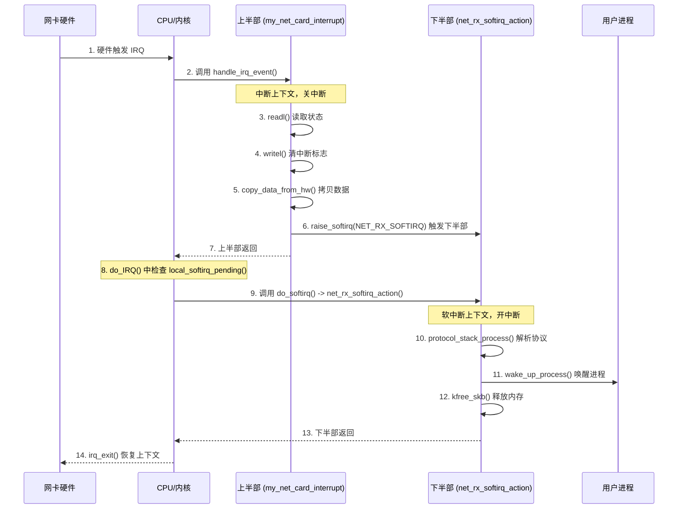

没问题，结合具体的代码（这里以 **Linux 内核**的经典实现为例）来解释，会让我们对上下半部的理解从“理论”直接落地到“工程实现”。

在 Linux 中，最经典的上下半部代码模型是 **硬中断（Hard IRQ） + 软中断（Softirq）**，或者 **硬中断 + Tasklet**。我们以网卡接收数据包为例，用伪代码来还原整个流程。

### 0.1.1 核心数据结构与上下文

在写代码前，必须明确一点：上半部运行在**中断上下文（Interrupt Context）**，下半部运行在**软中断上下文（Softirq Context）**。它们都没有进程上下文（没有 `current` 宏指向的进程），因此**绝对不能睡眠**。

### 0.1.2 上半部代码（硬中断处理函数）

上半部由硬件中断直接触发，代码必须极其精简。

```c
// 假设这是网卡驱动的中断处理函数
// 该函数由内核的中断向量表调用，运行在中断上下文，此时 CPU 关闭中断
irqreturn_t my_net_card_interrupt(int irq, void *dev_id) {
    struct my_net_card *card = (struct my_net_card *)dev_id;
    u32 status;

    // 1. 读取硬件状态寄存器，确认是否是本设备的中断
    status = readl(card->reg_base + STATUS_REG);
    if (!(status & RX_INTERRUPT))
        return IRQ_NONE; // 不是本设备中断，直接返回

    // 2. 关键操作：清除硬件中断标志位
    // 必须尽快清除，否则硬件会一直触发中断（中断风暴）
    writel(RX_INTERRUPT, card->reg_base + STATUS_REG);

    // 3. 将数据从硬件 FIFO 拷贝到内核内存（仅拷贝，不解析）
    // 这里只是把数据挪个地方，耗时极短
    copy_data_from_hw(card);

    // 4. 触发下半部（核心步骤）
    // 注意：这里只是"标记"下半部需要执行，并没有真正执行它
    // 内核会将这个软中断挂载到当前 CPU 的待处理队列中
    raise_softirq(NET_RX_SOFTIRQ); 

    // 5. 上半部结束，返回
    return IRQ_HANDLED;
}
```

**上半部代码总结：**
*   **做了什么**：确认中断、清中断标志、拷贝少量数据、**触发下半部**。
*   **没做什么**：没有解析协议、没有分配大内存、没有唤醒进程。
*   **执行时间**：通常只有几微秒。

---

### 0.1.3 下半部代码（软中断处理函数）

下半部由上半部触发，在内核的特定时机（通常是中断返回前夕）执行。它运行在**软中断上下文**，此时**开中断**（可以被新的硬中断打断）。

```c
// 这是软中断的处理函数，由内核在 do_softirq() 中调用
// 运行在软中断上下文，开中断，不可睡眠
static void net_rx_softirq_action(struct softirq_action *h) {
    struct sk_buff *skb;
    
    // 1. 循环处理上半部拷贝过来的所有数据包
    while ((skb = get_packet_from_queue())) {
        
        // 2. 复杂的协议栈处理（耗时操作）
        // 这里会解析以太网帧、IP 头、TCP/UDP 头
        // 这个过程非常耗时，绝对不能放在上半部
        protocol_stack_process(skb);
        
        // 3. 如果数据是给用户进程的，唤醒等待的进程
        // 将进程状态设为 TASK_RUNNING，并放入运行队列
        wake_up_process(skb->owner_process);
        
        // 4. 释放 skb 内存
        kfree_skb(skb);
    }
    
    // 5. 下半部结束
}
```

**下半部代码总结：**
*   **做了什么**：解析协议、处理大量数据、唤醒进程、内存释放。
*   **执行环境**：开中断，可以被新的硬中断打断（新硬中断会执行新的上半部，然后再次触发新的软中断，软中断会排队等待）。
*   **执行时间**：可能几十微秒到几毫秒。

---

### 0.1.4 内核调度代码（连接上下半部的桥梁）

上半部触发软中断后，下半部并不会立刻执行。它必须等待内核的调度。这个调度的核心代码在 `do_IRQ()` 的返回路径中：

```c
// 这是内核处理中断的通用入口（伪代码）
void do_IRQ(struct pt_regs *regs) {
    int irq = get_irq_number(regs);
    
    // 1. 执行上半部（硬中断处理函数）
    // 此时关中断，执行 my_net_card_interrupt
    handle_irq_event(irq, regs);
    
    // 2. 上半部执行完毕，准备返回
    // 在返回被中断的上下文之前，检查是否有待处理的软中断
    // 这是下半部执行的"标准时机"
    if (local_softirq_pending()) {
        // 3. 开中断，执行下半部
        // 注意：这里会调用 net_rx_softirq_action
        do_softirq();
    }
    
    // 4. 恢复被中断的上下文，继续执行原任务
    irq_exit();
}
```

---

### 0.1.5 完整代码执行流程总结（Mermaid 结合代码）



### 0.1.6 为什么代码要这么写？（工程视角）

1.  **`raise_softirq` 的妙用**：上半部代码中，`raise_softirq` 仅仅是一个**标记动作**。它设置了一个位图（bitmap），告诉内核“稍后请执行这个软中断”。这个动作极快，保证了上半部的短小精悍。
2.  **`do_softirq` 的时机**：放在 `irq_exit()` 之前，意味着“硬件紧急事务已处理完，现在趁返回用户态之前，把积压的脏活累活干完”。如果此时有新的硬中断进来，CPU 会暂停 `do_softirq`，去执行新的上半部，然后再回来继续。
3.  **`wake_up_process` 的位置**：唤醒进程这种操作会涉及到调度器的复杂逻辑，甚至可能触发进程切换，绝对不能放在关中断的上半部。放在开中断的下半部，即使唤醒过程耗时，也不会阻塞硬件响应。

**一句话总结代码层面的核心：**
上半部用 `raise_softirq` 埋下伏笔，下半部在 `do_IRQ` 返回前夕由 `do_softirq` 统一收割。这种“标记-延迟执行”的代码模式，是操作系统平衡性能与实时性的经典设计。