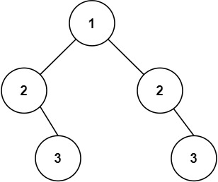

#树 #深度优先搜索 #广度优先搜索 #二叉树 
```button
name <font color="#548dd4">nvim打开</font>
type link
action file:///E%3A%5CDocuments%5CObsidian_%5CCpp%5CLeetcode%5C101.%E5%AF%B9%E7%A7%B0%E4%BA%8C%E5%8F%89%E6%A0%91.cpp
```
```button
name <font color="#4e937a">VSCode打开</font>
type link
action file:///code%20%22E%3A%5CDocuments%5CObsidian_%5CCpp%5CLeetcode%5C101.%E5%AF%B9%E7%A7%B0%E4%BA%8C%E5%8F%89%E6%A0%91.cpp%22
```

`button-anki-open`   `button-anki-update`

DECK: 面试题-hot100

## 0.1 101.对称二叉树

给你一个二叉树的根节点 `root` ， 检查它是否轴对称。

**示例 1：**


**输入：**root = [1,2,2,3,4,4,3]
**输出：**true

**示例 2：**



**输入：**root = [1,2,2,null,3,null,3]
**输出：**false

**提示：**

- 树中节点数目在范围 `[1, 1000]` 内
- `-100 <= Node.val <= 100`

**进阶：**你可以运用递归和迭代两种方法解决这个问题吗？

## 0.2 Notes


## 0.3 Solution 
**记得复制题目**

![[101.对称二叉树.cpp]]

### 0.3.1 递归
```cpp
class Solution {
public:
    bool isSymmetric(TreeNode* root) {
        return handler(root->left, root->right);
    }

    bool handler(TreeNode *left, TreeNode *right) {
        bool nl = left == nullptr, nr = right == nullptr;
        if (nl && nr) return true;  // 如果两边都为空
        if (nl || nr) return false; // 如果有且只有一端不为空
        // 两边都存在
        return left->val == right->val && handler(left->left, right->right) && handler(left->right, right->left);
    }
};
```


### 0.3.2 迭代
```typescript
const check = (u: TreeNode | null, v: TreeNode | null): boolean => {
    const q: (TreeNode | null)[] = [];
    q.push(u), q.push(v);
    while (q.length) {
        u = q.shift()!;
        v = q.shift()!;

        if (!u && !v) continue;
        if ((!u || !v) || (u.val != v.val)) return false;

        q.push(u.left);
        q.push(v.right);

        q.push(u.right);
        q.push(v.left);
    }
    return true;
}

function isSymmetric(root: TreeNode): boolean {
    return check(root, root);
};
```


END
<!--ID: 1773973207804-->

