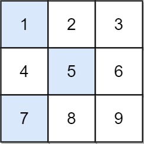

#数组 #动态规划 #矩阵 
```button
name <font color="#548dd4">nvim打开</font>
type link
action file:///E%3A%5CDocuments%5CObsidian_%5CCpp%5CLeetcode%5C1224.%E4%B8%8B%E9%99%8D%E8%B7%AF%E5%BE%84%E6%9C%80%E5%B0%8F%E5%92%8C%20%20II.cpp
```
```button
name <font color="#4e937a">VSCode打开</font>
type link
action file:///code%20%22E%3A%5CDocuments%5CObsidian_%5CCpp%5CLeetcode%5C1224.%E4%B8%8B%E9%99%8D%E8%B7%AF%E5%BE%84%E6%9C%80%E5%B0%8F%E5%92%8C%20%20II.cpp%22
```

`button-anki-open`   `button-anki-update`

DECK: 面试题-hot100

## 0.1 1224.下降路径最小和  II

给你一个 `n x n` 整数矩阵 `grid` ，请你返回 **非零偏移下降路径** 数字和的最小值。

**非零偏移下降路径** 定义为：从 `grid` 数组中的每一行选择一个数字，且按顺序选出来的数字中，相邻数字不在原数组的同一列。

**示例 1：**



**输入：**grid = [[1,2,3],[4,5,6],[7,8,9]]
**输出：**13
**解释：**
所有非零偏移下降路径包括：
[1,5,9], [1,5,7], [1,6,7], [1,6,8],
[2,4,8], [2,4,9], [2,6,7], [2,6,8],
[3,4,8], [3,4,9], [3,5,7], [3,5,9]
下降路径中数字和最小的是 [1,5,7] ，所以答案是 13 。

**示例 2：**

**输入：**grid = [[7]]
**输出：**7

**提示：**

- `n == grid.length == grid[i].length`
- `1 <= n <= 200`
- `-99 <= grid[i][j] <= 99`

## 0.2 Notes

### 0.2.1 两种写法对比

| 解法 | 时间复杂度 | 空间复杂度 | 核心手段 |
| --- | --- | --- | --- |
| 一、最小 / 次小值优化 | O(n²) | O(1)（原地改 `grid`） | 只留上一行的最小值和次小值 |
| 二、朴素 DP | O(n³) | O(n) | 每个状态枚举上一行所有列 |

### 0.2.2 核心思路：为什么「最小 + 次小」就够了

状态定义：`dp[j]` = 走到当前行第 `j` 列时的最小路径和。

约束是「相邻两行不能选同一列」，所以转移是：

`dp_new[j] = grid[i][j] + min{ dp[k] | k ≠ j }`

暴力枚举 `k` 就是解法二的 O(n³)。但注意 ==被排除的只有一个 `k = j`== ——
也就是「上一行去掉第 j 列之后的最小值」。这个值只有两种可能：

- 上一行的最小值**不是**第 `j` 列 → 直接用上一行最小值 `mn`
- 上一行的最小值**正是**第 `j` 列 → 退而求其次，用上一行次小值 `mn2`

所以只要先求出上一行的 `mn` 和 `mn2`，每个状态 O(1) 转移，整体降到 O(n²)。

### 0.2.3 并列时为什么取「两个最小值」而不是「最小值 + 严格次小值」

用 `nsmallest(2, pre_row)` 是为了==天然吃掉并列==：

- `pre_row = [1, 1, 5]` → `mn = mn2 = 1`。判定 `pre != mn` 对第 0、1 列都为假，都去加 `mn2 = 1`，结果依然正确（换一列同样拿得到 1）。
- 若改成「最小值 + 严格次小值」，遇到并列还得额外统计"最小值出现了几次"，反而更啰嗦。

> 判据 `pre != mn` 比较的是**上一行第 j 列的取值**和**上一行最小值**，用值相等代替下标相等 —— 这是这段代码最巧的地方。

### 0.2.4 边界与依赖

- `n == 1`：Python 版 `pairwise(grid)` 不产生任何迭代，直接 `min(grid[-1])` 返回唯一元素，天然正确；C++ 版则显式 `if (n == 1) return grid[0][0];`。
- Python 版==原地修改== `grid`（把 `cur_row` 当 dp 数组累加），额外空间 O(1)，代价是会破坏输入。
- 依赖 `from itertools import pairwise`（Python 3.10+）和 `from heapq import nsmallest`，本地跑要自己 import。

## 0.3 Solution 
**记得复制题目**

**解法一：最小 / 次小值优化 —— O(n²)，本笔记主解法**

```python
class Solution:
    def minFallingPathSum(self, grid: List[List[int]]) -> int:
        for pre_row, cur_row in pairwise(grid):  # 枚举上一行和当前行
            mn, mn2 = nsmallest(2, pre_row)  # 上一行的最小值和次小值
            for j, pre in enumerate(pre_row):  # 枚举上一行的状态
                cur_row[j] += mn if pre != mn else mn2  # 不是最小就加上最小，否则加上次小
        return min(grid[-1])  # 第 n-1 行的最小值
```

**解法二：朴素 DP —— 枚举上一行所有列，O(n³)**

```cpp
class Solution {
public:
    int minFallingPathSum(vector<vector<int>>& grid) {
        int n = grid.size();
        if (n == 1) return grid[0][0]; 

        vector<int> dp(n, 0), new_dp(n, INT_MAX);
        for (int i = 0; i < n; i++) {
            dp[i] = grid[0][i];
        }
        
        // 循环迭代
        for (int i = 1; i < n; i++) {
            for (int j = 0; j < n; j++) {
                for (int k = 0; k < n; k++) {
                    if (j == k) continue;
                    new_dp[j] = min(new_dp[j], dp[k] + grid[i][j]);
                }
            }

            // 把dp替换成new_dp
            dp = new_dp;
            new_dp.assign(n, INT_MAX);
        }

        return *min_element(dp.begin(), dp.end());
    }
};
```

![[1224.下降路径最小和  II.cpp]]

END
