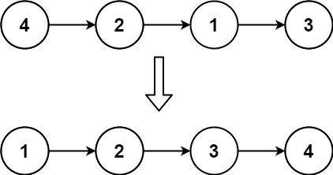
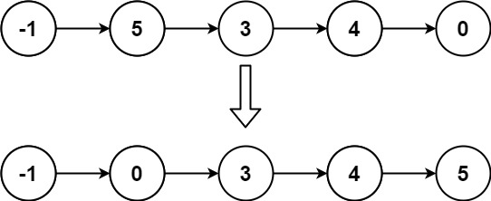

#链表 #排序 
```button
name <font color="#548dd4">打开nvim（自动创建.cpp）</font>
type link
action file:///E%3A%5CDocuments%5CObsidian_%5CCpp%5CLeetcode%5C147.%20%E5%AF%B9%E9%93%BE%E8%A1%A8%E8%BF%9B%E8%A1%8C%E6%8F%92%E5%85%A5%E6%8E%92%E5%BA%8F.cpp
```

`button-anki-open`   `button-anki-update`

DECK: 面试题-hot100

## 0.1 对链表进行插入排序

给定单个链表的头 `head` ，使用 **插入排序** 对链表进行排序，并返回 _排序后链表的头_ 。

**插入排序** 算法的步骤:

1. 插入排序是迭代的，每次只移动一个元素，直到所有元素可以形成一个有序的输出列表。
2. 每次迭代中，插入排序只从输入数据中移除一个待排序的元素，找到它在序列中适当的位置，并将其插入。
3. 重复直到所有输入数据插入完为止。

下面是插入排序算法的一个图形示例。部分排序的列表(黑色)最初只包含列表中的第一个元素。每次迭代时，从输入数据中删除一个元素(红色)，并就地插入已排序的列表中。

对链表进行插入排序。


**示例 1：**



**输入:** head = [4,2,1,3]
**输出:** [1,2,3,4]

**示例 2：**



**输入:** head = [-1,5,3,4,0]
**输出:** [-1,0,3,4,5]

**提示：**

- 列表中的节点数在 `[1, 5000]`范围内
- `-5000 <= Node.val <= 5000`

## 0.2 Notes
这题的链表解法比较精髓

## 0.3 Solution 

![[147. 对链表进行插入排序.cpp]]

```cpp
class Solution {
public:
    ListNode* insertionSortList(ListNode* head) {
        if (head == nullptr) {
            return head;
        }
        ListNode* dummyHead = new ListNode(0);
        dummyHead->next = head;
        ListNode* lastSorted = head;
        ListNode* curr = head->next;
        while (curr != nullptr) {
            if (lastSorted->val <= curr->val) {
                lastSorted = lastSorted->next;
            } else {
                ListNode *prev = dummyHead;
                while (prev->next->val <= curr->val) {
                    prev = prev->next;
                }
                lastSorted->next = curr->next;
                curr->next = prev->next;
                prev->next = curr;
            }
            curr = lastSorted->next;
        }
        return dummyHead->next;
    }
};
```

```go
func insertionSortList(head *ListNode) *ListNode {
    nodes := make([]*ListNode, 0, 0)
    for (head != nil) {
        nodes = append(nodes, head)
        head = head.Next
    }

    for i := 1; i < len(nodes); i++ {
        for j := i; j > 0; j-- {
            // 如果小于前面的节点就往前移, 交换移动
            v1, v2 := nodes[j].Val, nodes[j - 1].Val
            if (v1 < v2) {
                v1, v2 = v2, v1 // 交换
            }
        }
    }

    return nodes[0]
}
```

END
<!--ID: 1773973207778-->

