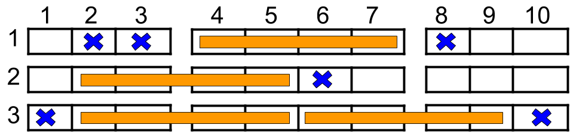

#贪心 #位运算 #数组 #哈希表 
```button
name <font color="#548dd4">nvim打开</font>
type link
action file:///E%3A%5CDocuments%5CObsidian_%5CCpp%5CLeetcode%5C1487.%E5%AE%89%E6%8E%92%E7%94%B5%E5%BD%B1%E9%99%A2%E5%BA%A7%E4%BD%8D.cpp
```
```button
name <font color="#4e937a">VSCode打开</font>
type link
action file:///code%20%22E%3A%5CDocuments%5CObsidian_%5CCpp%5CLeetcode%5C1487.%E5%AE%89%E6%8E%92%E7%94%B5%E5%BD%B1%E9%99%A2%E5%BA%A7%E4%BD%8D.cpp%22
```

`button-anki-open`   `button-anki-update`

DECK: 面试题-hot100

## 0.1 1487.安排电影院座位


如上图所示，电影院的观影厅中有 `n` 行座位，行编号从 1 到 `n` ，且每一行内总共有 10 个座位，列编号从 1 到 10 。

给定一个二维数组 `reservedSeats` ，其中 `reservedSeats[i] = [rowi, seati]` 表示第 `rowi` 行的座位 `seati` 已经被预定。

四人小组必须被安排在同一排的四个座位上。该小组可以坐在以下座位块之一：

- 座位 `2, 3, 4, 5`
- 座位 `4, 5, 6, 7`
- 座位 `6, 7, 8, 9`

只有当该块中的所有座位都 **没有** 被预订时，才能使用该块。每个座位 **最多** 只能分配给一个小组。

返回一个整数，表示可以分配的 **最大** 四人小组数量。

**示例 1：**



**输入：**n = 3, reservedSeats = [[1,2],[1,3],[1,8],[2,6],[3,1],[3,10]]
**输出：**4
**解释：**上图所示是最优的安排方案，总共可以安排 4 个家庭。蓝色的叉表示被预约的座位，橙色的连续座位表示一个 4 人家庭。

**示例 2：**

**输入：**n = 2, reservedSeats = [[2,1],[1,8],[2,6]]
**输出：**2

**示例 3：**

**输入：**n = 4, reservedSeats = [[4,3],[1,4],[4,6],[1,7]]
**输出：**4

**提示：**

- `1 <= n <= 109`
- `1 <= reservedSeats.length <= min(10 * n, 104)`
- `reservedSeats[i] == [rowi, seati]`
- `1 <= rowi <= n`
- `1 <= seati <= 10`
- 所有 `reservedSeats[i]` 都是互不相同的。

## 0.2 Notes

> **核心原理：位运算（Bitmask）**
> 用一个整数的二进制位来表示"这一行哪些座位被占用"，把本来需要 `n × 10` 个布尔值（O(n) 空间）的存储，压缩成"只为有预订的行存一个 int"（O(R) 空间，R = len(reservedSeats)）。**用位运算换空间**，正是本题的关键。

### 0.2.1 一、问题转化

- 每行 10 个座位，四人小组只能坐三个块：
  - 左块：`2, 3, 4, 5`
  - 中块：`4, 5, 6, 7`
  - 右块：`6, 7, 8, 9`
- 座位 **1 和 10 永远不参与** 四人组，可以直接忽略，因此只需要关心 2~9 号座位。
- 一行若 2~9 号**全空** → 可坐 **2 组**（左块 + 右块）。
- 一行若 2~9 号有**任意一个**预订 → 最多 **1 组**。原因：中块与左块、右块都重叠（分别共用 4,5 和 6,7），能共存的只有"左块 + 右块"，而它俩同时为空要求 2~9 全空。

### 0.2.2 二、位运算如何节省空间

- 用 8 位二进制数 `x` 表示某行 2~9 号座位的占用情况：
  - 第 `i` 位（`i = seat - 2`）为 1 ⇔ 座位 `seat` 被预订：`x |= 1 << (seat - 2)`
  - 三个块的掩码（Mask）：
    - 左块：`0b1111`（位 0~3）→ 座位 2,3,4,5
    - 中块：`0b111100`（位 2~5）→ 座位 4,5,6,7
    - 右块：`0b11110000`（位 4~7）→ 座位 6,7,8,9
- **空间上**：不建 `n × 10` 的大数组（n 最大 `10^9`，无法承受），而是用哈希表 `row -> int` 只存**有预订的行**，一行只占一个 int（R 最多 `10^4`）。
- **时间上**：判断某个块是否全空，只需一次按位与 `x & mask == 0`，把"查 4 个座位"变成"查 1 个数"。

### 0.2.3 三、算法步骤

1. 遍历 `reservedSeats`，只处理 `2 <= seat <= 9` 的座位，将对应行的 bitmask 置位：`seats[row] |= 1 << (seat - 2)`。
2. 统计"空行"：`empty_rows = n - len(seats)`。没进哈希表的行 = 2~9 全空（含只订了 1 或 10 号座位的行），每行可坐 2 组：`ans = empty_rows * 2`。
3. 遍历哈希表中每行的 mask `x`，若左 / 中 / 右任意一个块满足 `x & mask == 0`，则 `ans += 1`（该行能坐 1 组）。

### 0.2.4 四、复杂度

- 时间：O(R)，R = len(reservedSeats)。
- 空间：O(R)（哈希表），**不随 n 增长** —— 位运算 + 哈希表把 O(n) 的空间降到了 O(R)。

## 0.3 Solution 
```python
class Solution:
    def maxNumberOfFamilies(self, n: int, reservedSeats: List[List[int]]) -> int:
        seats = defaultdict(int)  # 2~9 有预定座位的行 -> 这一行具体哪些座位被预定
        for row, seat in reservedSeats:
            if 2 <= seat <= 9:
                seats[row] |= 1 << (seat - 2)  # 把二进制数的 seat-2 这一位变成 1

        # 注意：如果某一行只有 1 和 10 被预定，那么这一行不会插到哈希表中（相当于这一行是空的）
        # 示例 1 只有第 1 行和第 2 行插到哈希表中
        empty_rows = n - len(seats)
        ans = empty_rows * 2  # 一个空行可以容量 2 个四人小组
        for x in seats.values():
            # 在哈希表中的行，由于 2~9 至少一个座位被预定，所以至多容纳 1 个四人小组，ans 至多增加 1
            if x & 0b1111 == 0 or x & 0b111100 == 0 or x & 0b11110000 == 0:
                ans += 1
        return ans
```


![[1487.安排电影院座位.cpp]]

END
