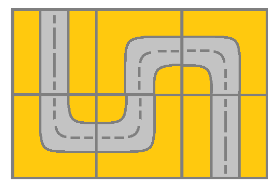
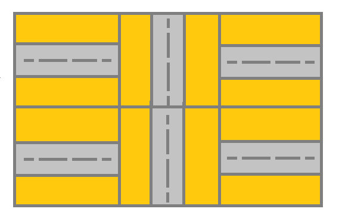

#深度优先搜索 #广度优先搜索 #并查集 #数组 #矩阵 
```button
name <font color="#548dd4">nvim打开</font>
type link
action file:///E%3A%5CDocuments%5CObsidian_%5CCpp%5CLeetcode%5C1507.%E6%A3%80%E6%9F%A5%E7%BD%91%E6%A0%BC%E4%B8%AD%E6%98%AF%E5%90%A6%E5%AD%98%E5%9C%A8%E6%9C%89%E6%95%88%E8%B7%AF%E5%BE%84.cpp
```
```button
name <font color="#4e937a">VSCode打开</font>
type link
action file:///code%20%22E%3A%5CDocuments%5CObsidian_%5CCpp%5CLeetcode%5C1507.%E6%A3%80%E6%9F%A5%E7%BD%91%E6%A0%BC%E4%B8%AD%E6%98%AF%E5%90%A6%E5%AD%98%E5%9C%A8%E6%9C%89%E6%95%88%E8%B7%AF%E5%BE%84.cpp%22
```

`button-anki-open`   `button-anki-update`

DECK: 面试题-hot100

## 0.1 1507.检查网格中是否存在有效路径

给你一个 _m_ x _n_ 的网格 `grid`。网格里的每个单元都代表一条街道。`grid[i][j]` 的街道可以是：

- **1** 表示连接左单元格和右单元格的街道。
- **2** 表示连接上单元格和下单元格的街道。
- **3** 表示连接左单元格和下单元格的街道。
- **4** 表示连接右单元格和下单元格的街道。
- **5** 表示连接左单元格和上单元格的街道。
- **6** 表示连接右单元格和上单元格的街道。


你最开始从左上角的单元格 `(0,0)` 开始出发，网格中的「有效路径」是指从左上方的单元格 `(0,0)` 开始、一直到右下方的 `(m-1,n-1)` 结束的路径。**该路径必须只沿着街道走**。

**注意：**你 **不能** 变更街道。

如果网格中存在有效的路径，则返回 `true`，否则返回 `false` 。

**示例 1：**



**输入：**grid = [[2,4,3],[6,5,2]]
**输出：**true
**解释：**如图所示，你可以从 (0, 0) 开始，访问网格中的所有单元格并到达 (m - 1, n - 1) 。

**示例 2：**



**输入：**grid = [[1,2,1],[1,2,1]]
**输出：**false
**解释：**如图所示，单元格 (0, 0) 上的街道没有与任何其他单元格上的街道相连，你只会停在 (0, 0) 处。

**示例 3：**

**输入：**grid = [[1,1,2]]
**输出：**false
**解释：**你会停在 (0, 1)，而且无法到达 (0, 2) 。

**示例 4：**

**输入：**grid = [[1,1,1,1,1,1,3]]
**输出：**true

**示例 5：**

**输入：**grid = [[2],[2],[2],[2],[2],[2],[6]]
**输出：**true

**提示：**

- `m == grid.length`
- `n == grid[i].length`
- `1 <= m, n <= 300`
- `1 <= grid[i][j] <= 6`

## 0.2 Notes


## 0.3 Solution 

![[1507.检查网格中是否存在有效路径.cpp]]

```cpp  
class UnionFind {
public:
    vector<int> parent;  // 父节点数组
    vector<int> rank;    // 秩（树的高度）数组

public:
    // 初始化：size 为元素个数
    UnionFind(int size = 1'000'001) {
        parent.resize(size);
        rank.resize(size, 0);
        // 每个元素初始父节点是自己
        for (int i = 0; i < size; ++i) {
            parent[i] = i;
        }
    }

    // 查找根节点 + 路径压缩
    int find(int x) {
        if (parent[x] != x) {
            parent[x] = find(parent[x]); // 路径压缩
        }
        return parent[x];
    }

    // 合并两个节点，返回是否成功合并
    // false：已经在同一个集合
    // true：合并成功
    bool unite(int x, int y) {
        int rootX = find(x);
        int rootY = find(y);

        // 同一个集合，无需合并
        if (rootX == rootY) {
            return false;
        }

        // 按秩合并：小树挂到大树上
        if (rank[rootX] < rank[rootY]) {
            parent[rootX] = rootY;
        } else {
            parent[rootY] = rootX;
            // 秩相同，合并后高度 +1
            if (rank[rootX] == rank[rootY]) {
                rank[rootX]++;
            }
        }
        return true;
    }
};

class Solution {
public:
    bool hasValidPath(vector<vector<int>>& grid) {
        int n = grid.size(), m = grid[0].size();
        UnionFind uf(n * m);

        auto pos = [=](int i, int j) {
            return i * m + j;
        };

        auto tackle = [&](int i, int j) {
            int r = grid[i][j];
            if (r == 1 || r == 4 || r == 6) {
                if (j + 1 < m) {
                    int rr = grid[i][j + 1];
                    if (rr == 1 || rr == 3 || rr == 5) {
                        uf.unite(pos(i, j), pos(i, j + 1));
                    }
                }
            } 
            // 应该两个都要考虑
            if (r == 2 || r == 3 || r == 4) {
                if (i + 1 < n) {
                    int rd = grid[i + 1][j];
                    if (rd == 2 || rd == 5 || rd == 6) {
                        uf.unite(pos(i, j), pos(i + 1, j));
                    }
                }
            }
        };
        
        for (int i = 0; i < n; ++i) {
            for (int j = 0; j < m; ++j) {
                tackle(i, j);
                LV(uf.parent);
            }
        }

        return uf.find(0) == uf.find(pos(n - 1, m - 1));
    }
};

```  
END
<!--ID: 1777301801205-->
 
