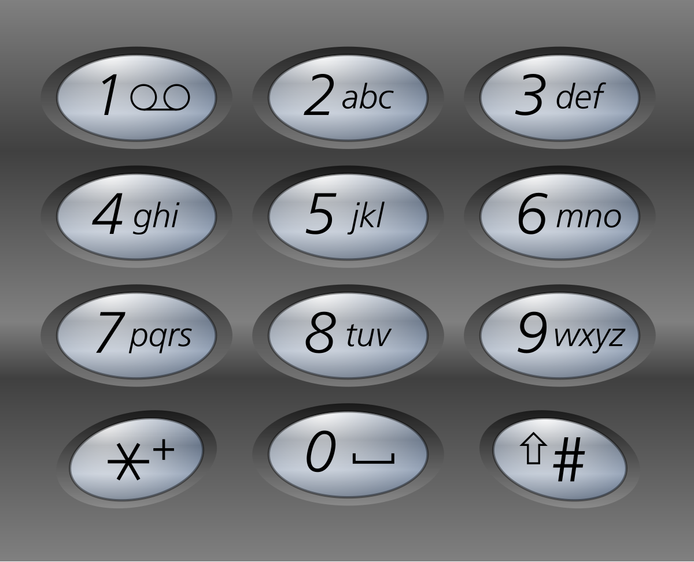

#哈希表 #字符串 #回溯 
```button
name <font color="#548dd4">nvim打开</font>
type link
action file:///E%3A%5CDocuments%5CObsidian_%5CCpp%5CLeetcode%5C17.%E7%94%B5%E8%AF%9D%E5%8F%B7%E7%A0%81%E7%9A%84%E5%AD%97%E6%AF%8D%E7%BB%84%E5%90%88.cpp
```
```button
name <font color="#4e937a">VSCode打开</font>
type link
action file:///code%20%22E%3A%5CDocuments%5CObsidian_%5CCpp%5CLeetcode%5C17.%E7%94%B5%E8%AF%9D%E5%8F%B7%E7%A0%81%E7%9A%84%E5%AD%97%E6%AF%8D%E7%BB%84%E5%90%88.cpp%22
```

`button-anki-open`   `button-anki-update`

DECK: 面试题-hot100

## 0.1 17.电话号码的字母组合

给定一个仅包含数字 `2-9` 的字符串，返回所有它能表示的字母组合。答案可以按 **任意顺序** 返回。

给出数字到字母的映射如下（与电话按键相同）。注意 1 不对应任何字母。



**示例 1：**

**输入：**digits = "23"
**输出：**["ad","ae","af","bd","be","bf","cd","ce","cf"]

**示例 2：**

**输入：**digits = "2"
**输出：**["a","b","c"]

**提示：**

- `1 <= digits.length <= 4`
- `digits[i]` 是范围 `['2', '9']` 的一个数字。

## 0.2 Notes


## 0.3 Solution 

![[17.电话号码的字母组合.cpp]]


```cpp  
#include <bits/stdc++.h>
using namespace std;

class Solution {
private:
    vector<string> ans;
    string path;
    map<int, string> mp;


public:
    Solution() {
        mp = {
            {'2', "abc"},
            {'3', "def"},
            {'4', "ghi"},
            {'5', "mno"},
            {'6', "jkl"},
            {'7', "pqrs"},
            {'8', "tuv"},
            {'9', "wxyz"},
        };
    }

    vector<string> letterCombinations(string digits) {


        dfs(0, digits);
        return ans;
    }

    void dfs(int step, string &digits) {
        if (step >= digits.size()) {
            ans.push_back(path);
            return;
        }

        auto num = digits[step];
        auto s = mp[num];
        for (int i = 0; i < s.size(); i++) {
            path.push_back(s[i]);
            dfs(step + 1, digits);
            path.pop_back();
        }
    }
};
```  
END
<!--ID: 1777301801236-->
 
