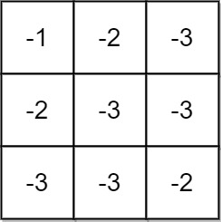
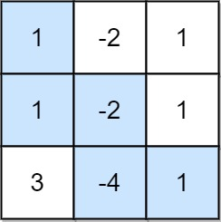
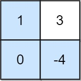

#数组 #动态规划 #矩阵 
```button
name <font color="#548dd4">nvim打开</font>
type link
action file:///E%3A%5CDocuments%5CObsidian_%5CCpp%5CLeetcode%5C1716.%E7%9F%A9%E9%98%B5%E7%9A%84%E6%9C%80%E5%A4%A7%E9%9D%9E%E8%B4%9F%E7%A7%AF.cpp
```
```button
name <font color="#4e937a">VSCode打开</font>
type link
action file:///code%20%22E%3A%5CDocuments%5CObsidian_%5CCpp%5CLeetcode%5C1716.%E7%9F%A9%E9%98%B5%E7%9A%84%E6%9C%80%E5%A4%A7%E9%9D%9E%E8%B4%9F%E7%A7%AF.cpp%22
```

`button-anki-open`   `button-anki-update`

DECK: 面试题-hot100

## 0.1 1716.矩阵的最大非负积

给你一个大小为 `m x n` 的矩阵 `grid` 。最初，你位于左上角 `(0, 0)` ，每一步，你可以在矩阵中 **向右** 或 **向下** 移动。

在从左上角 `(0, 0)` 开始到右下角 `(m - 1, n - 1)` 结束的所有路径中，找出具有 **最大非负积** 的路径。路径的积是沿路径访问的单元格中所有整数的乘积。

返回 **最大非负积** 对 **`109 + 7`** **取余** 的结果。如果最大积为 **负数** ，则返回 `-1` 。

**注意，**取余是在得到最大积之后执行的。

**示例 1：**



**输入：**grid = [[-1,-2,-3],[-2,-3,-3],[-3,-3,-2]]
**输出：**-1
**解释：**从 (0, 0) 到 (2, 2) 的路径中无法得到非负积，所以返回 -1 。

**示例 2：**



**输入：**grid = [[1,-2,1],[1,-2,1],[3,-4,1]]
**输出：**8
**解释：**最大非负积对应的路径如图所示 (1 * 1 * -2 * -4 * 1 = 8)

**示例 3：**



**输入：**grid = [[1,3],[0,-4]]
**输出：**0
**解释：**最大非负积对应的路径如图所示 (1 * 0 * -4 = 0)

**提示：**

- `m == grid.length`
- `n == grid[i].length`
- `1 <= m, n <= 15`
- `-4 <= grid[i][j] <= 4`

## 0.2 Notes


## 0.3 Solution 
**记得复制题目**

![[1716.矩阵的最大非负积.cpp]]

```cpp  
class Solution {
public:
    const int MOD = 1e9 + 7;

    int maxProductPath(vector<vector<int>>& grid) {
        int n = grid.size(), m = grid[0].size();
        // DP数组：[i][j][0]最大积，[i][j][1]最小积（用long long避免溢出）
        vector<vector<vector<long long>>> dp(n, vector<vector<long long>>(m, vector<long long>(2)));
        
        // 初始化起点
        dp[0][0][0] = dp[0][0][1] = grid[0][0];

        // 初始化第一列（只能从上边来）
        for (int i = 1; i < n; ++i) {
            long long val = dp[i-1][0][0] * grid[i][0];
            dp[i][0][0] = dp[i][0][1] = val;
        }

        // 初始化第一行（只能从左边来）
        for (int j = 1; j < m; ++j) {
            long long val = dp[0][j-1][0] * grid[0][j];
            dp[0][j][0] = dp[0][j][1] = val;
        }

        // 主循环：同时计算最大/最小积，无需手写num正负分支
        for (int i = 1; i < n; ++i) {
            for (int j = 1; j < m; ++j) {
                long long num = grid[i][j];
                // 拿到上方、左方的最大+最小值（共4个候选值）
                long long up_max = dp[i-1][j][0] * num;
                long long up_min = dp[i-1][j][1] * num;
                long long left_max = dp[i][j-1][0] * num;
                long long left_min = dp[i][j-1][1] * num;
                
                // 新的最大=4个候选值的最大值，新的最小=4个候选值的最小值
                dp[i][j][0] = max({up_max, up_min, left_max, left_min});
                dp[i][j][1] = min({up_max, up_min, left_max, left_min});
            }
        }

        // 最后筛选非负结果，再取模
        long long res = dp[n-1][m-1][0];
        return res < 0 ? -1 : res % MOD;
    }
};
```  
END
<!--ID: 1774581130539-->
 
