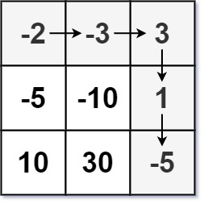

#数组 #动态规划 #矩阵 
```button
name <font color="#548dd4">nvim打开</font>
type link
action file:///E%3A%5CDocuments%5CObsidian_%5CCpp%5CLeetcode%5C174.%E5%9C%B0%E4%B8%8B%E5%9F%8E%E6%B8%B8%E6%88%8F.cpp
```
```button
name <font color="#4e937a">VSCode打开</font>
type link
action file:///code%20%22E%3A%5CDocuments%5CObsidian_%5CCpp%5CLeetcode%5C174.%E5%9C%B0%E4%B8%8B%E5%9F%8E%E6%B8%B8%E6%88%8F.cpp%22
```

`button-anki-open`   `button-anki-update`

DECK: 面试题-hot100

## 0.1 174.地下城游戏

恶魔们抓住了公主并将她关在了地下城 `dungeon` 的 **右下角** 。地下城是由 `m x n` 个房间组成的二维网格。我们英勇的骑士最初被安置在 **左上角** 的房间里，他必须穿过地下城并通过对抗恶魔来拯救公主。

骑士的初始健康点数为一个正整数。如果他的健康点数在某一时刻降至 0 或以下，他会立即死亡。

有些房间由恶魔守卫，因此骑士在进入这些房间时会失去健康点数（若房间里的值为_负整数_，则表示骑士将损失健康点数）；其他房间要么是空的（房间里的值为 _0_），要么包含增加骑士健康点数的魔法球（若房间里的值为_正整数_，则表示骑士将增加健康点数）。

为了尽快解救公主，骑士决定每次只 **向右** 或 **向下** 移动一步。

返回确保骑士能够拯救到公主所需的最低初始健康点数。

**注意：**任何房间都可能对骑士的健康点数造成威胁，也可能增加骑士的健康点数，包括骑士进入的左上角房间以及公主被监禁的右下角房间。

**示例 1：**



**输入：**dungeon = [[-2,-3,3],[-5,-10,1],[10,30,-5]]
**输出：**7
**解释：**如果骑士遵循最佳路径：右 -> 右 -> 下 -> 下 ，则骑士的初始健康点数至少为 7 。

**示例 2：**

**输入：**dungeon = [[0]]
**输出：**1

**提示：**

- `m == dungeon.length`
- `n == dungeon[i].length`
- `1 <= m, n <= 200`
- `-1000 <= dungeon[i][j] <= 1000`

## 0.2 Notes

### 0.2.1 核心难点：为什么正向 DP 不满足最优子结构？

初看这道题，很容易想到用正向 DP（类似 [[不同路径]] 或 [[最小路径和]]），从左上角推到右下角，记录到达每个格子的「最大剩余血量」或「最小初始血量」。但正向推是**推不出来**的——因为最优子结构不成立。

举个反例：到达某个格子 `(i, j)` 时，路径 A 剩余 10 点血，路径 B 剩余 5 点血。直觉上路径 A 更好（血多）。但如果接下来全是加血的格子，那路径 B 的 5 点血也够用；如果接下来全是扣血的格子，路径 A 的 10 点血可能刚好够，路径 B 不够。**关键在于：当前剩余血量多，并不意味着需要的初始血量少。** 正向 DP 无法同时兼顾「当前血量」和「初始血量」两个维度。

因此有两种思路可以绕过这个问题：

1. **二分答案 + 可行性判断**（取巧）：既然推不出「最优」，那就猜一个初始血量，然后验证它能不能走到终点。能就走，不能就加。
2. **逆向 DP**（标准解法）：从终点倒推，定义 `dp[i][j]` = 从 `(i,j)` 到终点所需的最小初始血量。这样就能避开正向的最优子结构陷阱。

---

## 0.3 Solution

### 0.3.1 方法一：二分答案 + 记忆化搜索（正向模拟）

**思路：**

不直接求「最低初始血量」，而是猜一个初始血量 `mid`，然后用 DFS 模拟从起点走到终点，检查这个血量是否够用。如果够用，说明答案 ≤ `mid`，缩小右边界；如果不够，说明答案 > `mid`，增大左边界。二分到底，`l` 就是最小可行的初始血量。

这个 DFS 的「记忆化」本质上是可行性判断，不是传统意义上的 DP 状态转移。它回答的是：**给出一个初始血量，能不能活着走到终点？**

**流程：**

```
二分搜索初始血量 HP ∈ [1, 1e9]
  对于每个 mid:
    DFS(mid, 0, 0) 判断是否能到达终点
      能 → r = mid - 1（尝试更小的初始血量）
      不能 → l = mid + 1（需要更大的初始血量）
返回 l
```

**复杂度分析：**
- 二分范围 `[1, 1e9]`，约 30 次迭代
- 每次 DFS 最坏 `O(m × n)`（记忆化避免重复搜索）
- 总复杂度：`O(log(INT_MAX) × m × n) ≈ 30 × 40000 = 1.2 × 10^6`，完全可行

> **注**：`@cache` 装饰器缓存了 `(hp, i, j)` 三元组，实际搜索空间有限，因为：
> - `hp` 经过每个格子的加减后变化范围可控
> - 一旦某个 `(hp, i, j)` 被判定为 `False`，后续相同状态直接返回

```python
from functools import cache
from typing import List
INT_MAX = 2**31 - 1

class Solution:
    def calculateMinimumHP(self, dungeon: List[List[int]]) -> int:
        n, m = len(dungeon), len(dungeon[0])

        @cache
        def dfs(hp: int, i: int, j: int) -> bool:
            """判断初始血量为 hp 时，从 (i,j) 能否走到终点"""
            if i >= n or j >= m:
                return False

            nhp = hp + dungeon[i][j]
            if nhp <= 0:      # 血量归零或为负，死亡
                return False
            if i == n - 1 and j == m - 1:  # 到达公主房间且活着
                return True

            # 尝试向右或向下走
            return dfs(nhp, i + 1, j) or dfs(nhp, i, j + 1)

        l, r = 1, INT_MAX // 2
        while l <= r:
            mid = l + (r - l) // 2
            if dfs(mid, 0, 0):
                r = mid - 1
            else:
                l = mid + 1

        # 循环结束后 l = r + 1，l 是最小满足条件的健康点数
        return l
```

**等价写法（正向 DP 判可行性，无递归）：**

如果不喜欢递归 + 记忆化的写法，也可以用二维 DP 做可行性判断。对于给定的初始血量 `initHP`，定义 `dp[i][j]` = 到达 `(i,j)` 时的最大剩余血量（`-1` 表示不可达），然后正向递推：

```python
def canReach(self, dungeon: List[List[int]], initHP: int) -> bool:
    n, m = len(dungeon), len(dungeon[0])
    dp = [[-1] * m for _ in range(n)]
    dp[0][0] = initHP + dungeon[0][0]
    if dp[0][0] <= 0:
        return False

    for i in range(n):
        for j in range(m):
            if i == 0 and j == 0:
                continue
            best = -1
            if i > 0 and dp[i - 1][j] > 0:
                best = max(best, dp[i - 1][j] + dungeon[i][j])
            if j > 0 and dp[i][j - 1] > 0:
                best = max(best, dp[i][j - 1] + dungeon[i][j])
            dp[i][j] = best

    return dp[n - 1][m - 1] > 0
```

> 为什么这里正向 DP 可行？因为这里只做**可行性判断**（固定初始血量），不是求最优解。血量越多越好是单调的——到了某个格子血量越多，后续存活概率越大，所以取 `max` 是安全的。

---

### 0.3.2 方法二：逆向 DP（标准解法）

**思路：**

既然正向推有最优子结构的问题，那就**从终点倒着推**。定义 `dp[i][j]` = 从格子 `(i, j)` 出发，到达终点 `(n-1, m-1)` 所需的最小初始血量。

从终点开始考虑：
- 骑士到达终点 `(n-1, m-1)` 后，血量必须 ≥ 1。所以进入终点**之前**的血量 `need` 必须满足 `need + dungeon[n-1][m-1] ≥ 1`，即 `need ≥ 1 - dungeon[n-1][m-1]`。
- 因此 `dp[n-1][m-1] = max(1, 1 - dungeon[n-1][m-1])`。

对于一般格子 `(i, j)`：
- 下一步要么去 `(i+1, j)` 要么去 `(i, j+1)`，我们选需要初始血量**更少**的方向：`min(dp[i+1][j], dp[i][j+1])`。
- 进入 `(i, j)` 后血量变为 `hp + dungeon[i][j]`，这个值必须 ≥ 下一步所需：`hp + dungeon[i][j] ≥ min(dp[i+1][j], dp[i][j+1])`。
- 所以 `hp ≥ min(dp[i+1][j], dp[i][j+1]) - dungeon[i][j]`，且 `hp ≥ 1`（血量始终为正）。
- 因此 `dp[i][j] = max(1, min(dp[i+1][j], dp[i][j+1]) - dungeon[i][j])`。

**状态转移方程：**

```
dp[n-1][m-1] = max(1, 1 - dungeon[n-1][m-1])

dp[i][j] = max(1, min(dp[i+1][j], dp[i][j+1]) - dungeon[i][j])
```

**图解（示例 1）：**

`dungeon = [[-2, -3, 3], [-5, -10, 1], [10, 30, -5]]`

从右下角倒推：

```
           →    →    ↓
[-2]  [-3]  [ 3]
[-5]  [-10] [ 1]
[10]  [30]  [-5]  ← 终点: dp = max(1, 1-(-5)) = 6

倒推第 3 行: dp[2][2]=6 → dp[2][1]=max(1,6-30)=1 → dp[2][0]=max(1,1-10)=1
倒推第 2 行: dp[1][2]=max(1,min(1,6)-1)=1 → dp[1][1]=max(1,min(1,1)-(-10))=11 → dp[1][0]=max(1,min(1,11)-(-5))=6
倒推第 1 行: dp[0][2]=max(1,min(6,1)-3)=5 → dp[0][1]=max(1,min(11,5)-(-3))=8 → dp[0][0]=max(1,min(6,8)-(-2))=7

答案: dp[0][0] = 7 ✓
```

**空间优化：**

`dp[i][j]` 只依赖于右边和下面的格子，可以压缩成一维数组 `dp[j]`，倒序遍历列即可：

```
dp[j] = max(1, min(dp[j], dp[j+1]) - dungeon[i][j])
```

其中 `dp[j]` 表示下一行（`i+1`）的值，`dp[j+1]` 表示当前行右边的值。

```python
from typing import List

class Solution:
    def calculateMinimumHP(self, dungeon: List[List[int]]) -> int:
        n, m = len(dungeon), len(dungeon[0])

        # dp[j] 表示从当前行 (i, j) 到终点所需的最小初始血量
        dp = [0] * m

        # 从右下角开始倒推
        for i in range(n - 1, -1, -1):
            for j in range(m - 1, -1, -1):
                if i == n - 1 and j == m - 1:
                    dp[j] = max(1, 1 - dungeon[i][j])
                elif i == n - 1:
                    dp[j] = max(1, dp[j + 1] - dungeon[i][j])
                elif j == m - 1:
                    dp[j] = max(1, dp[j] - dungeon[i][j])
                else:
                    dp[j] = max(1, min(dp[j], dp[j + 1]) - dungeon[i][j])

        return dp[0]
```

**未优化版（二维 dp，更直观）：**

```python
class Solution:
    def calculateMinimumHP(self, dungeon: List[List[int]]) -> int:
        n, m = len(dungeon), len(dungeon[0])
        dp = [[0] * m for _ in range(n)]

        for i in range(n - 1, -1, -1):
            for j in range(m - 1, -1, -1):
                if i == n - 1 and j == m - 1:
                    dp[i][j] = max(1, 1 - dungeon[i][j])
                elif i == n - 1:
                    dp[i][j] = max(1, dp[i][j + 1] - dungeon[i][j])
                elif j == m - 1:
                    dp[i][j] = max(1, dp[i + 1][j] - dungeon[i][j])
                else:
                    dp[i][j] = max(1, min(dp[i + 1][j], dp[i][j + 1]) - dungeon[i][j])

        return dp[0][0]
```

**复杂度分析：**
- 时间复杂度：`O(n × m)`，每个格子只计算一次
- 空间复杂度：二维版本 `O(n × m)`，一维优化版 `O(m)`

---

### 0.3.3 两种方法对比

| 维度 | 方法一：二分 + 可行性判断 | 方法二：逆向 DP |
|------|-------------------------|----------------|
| 核心思想 | 猜测答案 + 验证 | 从终点倒推最优解 |
| 时间复杂度 | `O(log(HP_max) × m × n)` | `O(m × n)` |
| 空间复杂度 | `O(m × n)`（缓存） | `O(m)`（压缩后） |
| 实现难度 | 思路直接，但容易超时/爆栈 | 需要想到「倒推」，代码简洁 |
| 是否取巧 | ✅ 是，绕过了正向 DP 的难点 | ❌ 否，是本题的标准解法 |

**建议**：面试时优先讲方法二（逆向 DP），方法一可以作为思路过渡或备选方案。


![[174.地下城游戏.cpp]]

END
