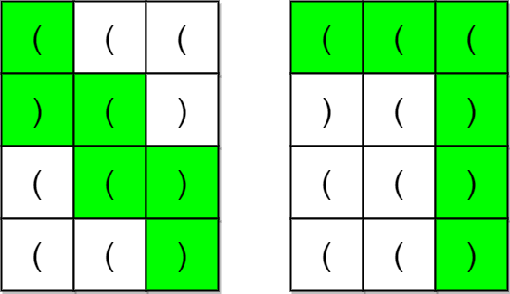
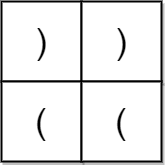

#数组 #动态规划 #矩阵 #括号序列 
```button
name <font color="#548dd4">nvim打开</font>
type link
action file:///E%3A%5CDocuments%5CObsidian_%5CCpp%5CLeetcode%5C2349.%E6%A3%80%E6%9F%A5%E6%98%AF%E5%90%A6%E6%9C%89%E5%90%88%E6%B3%95%E6%8B%AC%E5%8F%B7%E5%AD%97%E7%AC%A6%E4%B8%B2%E8%B7%AF%E5%BE%84.py
```
```button
name <font color="#4e937a">VSCode打开</font>
type link
action file:///code%20%22E%3A%5CDocuments%5CObsidian_%5CCpp%5CLeetcode%5C2349.%E6%A3%80%E6%9F%A5%E6%98%AF%E5%90%A6%E6%9C%89%E5%90%88%E6%B3%95%E6%8B%AC%E5%8F%B7%E5%AD%97%E7%AC%A6%E4%B8%B2%E8%B7%AF%E5%BE%84.py%22
```

`button-anki-open`   `button-anki-update`

DECK: 面试题-hot100

## 0.1 2349.检查是否有合法括号字符串路径

一个括号字符串是一个 **非空** 且只包含 `'('` 和 `')'` 的字符串。如果下面 **任意** 条件为 **真** ，那么这个括号字符串就是 **合法的** 。

- 字符串是 `()` 。
- 字符串可以表示为 `AB`（`A` 连接 `B`），`A` 和 `B` 都是合法括号序列。
- 字符串可以表示为 `(A)` ，其中 `A` 是合法括号序列。

给你一个 `m x n` 的括号网格图矩阵 `grid` 。网格图中一个 **合法括号路径** 是满足以下所有条件的一条路径：

- 路径开始于左上角格子 `(0, 0)` 。
- 路径结束于右下角格子 `(m - 1, n - 1)` 。
- 路径每次只会向 **下** 或者向 **右** 移动。
- 路径经过的格子组成的括号字符串是 **合法** 的。

如果网格图中存在一条 **合法括号路径** ，请返回 `true` ，否则返回 `false` 。

**示例 1：**



**输入：**grid = [["(","(","("],[")","(",")"],["(","(",")"],["(","(",")"]]
**输出：**true
**解释：**上图展示了两条路径，它们都是合法括号字符串路径。
第一条路径得到的合法字符串是 "()(())" 。
第二条路径得到的合法字符串是 "((()))" 。
注意可能有其他的合法括号字符串路径。

**示例 2：**



**输入：**grid = [[")",")"],["(","("]]
**输出：**false
**解释：**两条可行路径分别得到 "))(" 和 ")((" 。由于它们都不是合法括号字符串，我们返回 false 。

**提示：**

- `m == grid.length`
- `n == grid[i].length`
- `1 <= m, n <= 100`
- `grid[i][j]` 要么是 `'('` ，要么是 `')'` 。

## 0.2 Notes

### 0.2.1 解法总览

| 解法 | 时间复杂度 | 空间复杂度 | 说明 |
| --- | --- | --- | --- |
| ==记忆化搜索（DFS + `@cache`）—— 本笔记主解法== | O(m·n·(m+n)) | O(m·n·(m+n)) | 自顶向下，状态 `(列, 行, 余额)` |
| 递推 DP（bitset 压缩余额维度） | O(m·n·(m+n)/64) | O(n·(m+n)/64) | 自底向上，按行滚动 + 位运算 |

> 两个解法的 ==状态空间完全一样==，区别只在「谁枚举、谁被缓存」：记忆化搜索从终点往回退，递推 DP 从起点往前铺。

### 0.2.2 核心思路：把「括号串合法」压成一个「余额」维度

合法括号串只有两条判据：

- **任意前缀**余额 ≥ 0（余额 = 已遇到的 `'('` 数 − `')'` 数）
- **整体**余额 == 0

而本题路径被限制成「只能向右 / 向下」，从 `(0,0)` 到 `(m-1,n-1)` 的步数是**定值**，路径经过的格子数恒为 ==m + n − 1==。

于是不需要真的把字符串拼出来 —— 只需要记住 ==走到当前格子时的余额==。状态维度从「路径 × 字符串」塌缩成 `(行, 列, 余额)` 三维。

### 0.2.3 三个可以提前判死的情况

| 判据 | 为什么 |
| --- | --- |
| `m + n − 1` 为**奇数** | 合法括号串长度必须为偶数，直接 `false` |
| 起点 `grid[0][0] == ')'` | 第一步余额就变负，无解 |
| 终点 `grid[m-1][n-1] == '('` | 结尾余额必然 ≥ 1，收不回来 |

> 这三条解法二显式写了出来，能砍掉大量状态；解法一（记忆化搜索）靠搜索本身自然处理，但==提前 return 同样能省不少时间==。

### 0.2.4 解法一：记忆化搜索

状态 `dfs(x, y, c)`：从 `(x, y)` 带着余额 `c` 出发，能否走到终点并且最终配平。

几处关键细节：

- 代码里 `x` 是**列**、`y` 是**行**，所以取格子写成 `grid[y][x]`，边界判断是 `x >= n or y >= m` —— 别被变量名绕进去。
- `if c < 0: return False` 是==最有效的剪枝==：余额一旦为负，后面无论怎么走都救不回来（对应合法括号串的第一条判据）。
- 终点判定用的是 `c == 1 and grid[y][x] == ')'`：==到达终点时还没消费终点格子本身==，所以要求「带着 1 份余额 + 终点是 `')'`」才刚好归零。
- 若先把终点格子算进余额再判断，条件就变成 `c == 0`，两种写法等价 —— 但==同一个状态里口径必须统一==，混用会错。
- `@cache` 保证每个 `(x, y, c)` 只算一次，总状态数 `m · n · (m+n)`。

### 0.2.5 解法二：递推 DP（按行滚动的 bitset）

把「余额」这一维塞进一个整数的二进制位：==bit `k` = 1 表示「余额为 `k`」可达==。

转移因此退化成整数的移位：

- 遇到 `'('` → `cur <<= 1`（余额 +1）
- 遇到 `')'` → `cur >>= 1`（余额 −1）

右移天然把「余额 0 再遇到 `')'`」的路径甩出界外 —— ==等价于记忆化搜索里的 `c < 0` 剪枝==，不需要额外判断。

另外两个要点：

- **行滚动**：`dp[j]` 一个数组同时充当「上一行第 `j` 列」和「当前行第 `j` 列」。读 `dp[j]`（从上方来）和 `dp[j-1]`（从左边来，本轮已更新）后原地覆盖，空间从 O(m·n·(m+n)) 降到 `n` 个整数。
- **剩余步数剪枝**：`cur & ((1 << (rem + 1)) - 1)`，其中 `rem = (m-1-i) + (n-1-j)` 是剩余步数。余额超过剩余步数就==必然闭合不完==，用掩码一次抹掉高位，比逐个判断快得多。

> 终点判定统一成一句：答案是 `dp[n-1] & 1`，即终点处余额恰好为 0。

### 0.2.6 复杂度

| 解法 | 时间复杂度 | 空间复杂度 |
| --- | --- | --- |
| 记忆化搜索 | O(m·n·(m+n)) | O(m·n·(m+n)) |
| 递推 DP（bitset） | O(m·n·(m+n)/64) | O(n·(m+n)/64) |

- `m, n ≤ 100` 时余额上界 `m+n ≤ 200`，状态总数约 `100 × 100 × 200 = 2e6`，两种写法都很轻松。
- 记忆化搜索常数更小、代码更直观，==面试优先写它==；DP 版本的价值在于把同一个状态空间换成「自底向上的遍历序 + 纯位运算」，适合对照理解。

## 0.3 Solution 
**记得复制题目**

**解法一：记忆化搜索（DFS + `@cache`）—— 本笔记主解法**

```python
class Solution:
    def hasValidPath(self, grid: List[List[str]]) -> bool:
        m, n = len(grid), len(grid[0])

        @cache
        def dfs(x: int, y: int, c: int) -> bool:
            if c < 0: return False # 如果有闭合不了的部分直接返回false
            if x >= n or y >= m: return False
            if x == n - 1 and  y == m - 1:
                if c == 1 and grid[y][x] == ')': return True 
                return False

            new_c = c + int(grid[y][x] == '(') - int(grid[y][x] == ')')
            return dfs(x, y + 1, new_c) or dfs(x + 1, y, new_c)
        
        return dfs(0, 0, 0)
```

**解法二：递推 DP（bitset 压缩余额维度）—— O(m·n·(m+n)/64)**

```python
class Solution:
    def hasValidPath(self, grid: List[List[str]]) -> bool:
        m, n = len(grid), len(grid[0])
        # 路径恰好经过 m + n - 1 个格子，长度必须是偶数才可能配平
        if (m + n) % 2 == 0:
            return False
        if grid[0][0] != '(' or grid[m - 1][n - 1] != ')':
            return False

        # dp[j] 是 bitset：bit k = 1 表示「余额为 k」能走到当前行的第 j 列
        dp = [0] * n
        for i in range(m):
            for j in range(n):
                if i == 0 and j == 0:
                    cur = 1 << 1                       # 起点必为 '('，余额 1
                else:
                    cur = (dp[j] if i else 0) | (dp[j - 1] if j else 0)  # 上方 + 左方
                    if grid[i][j] == '(':
                        cur <<= 1                      # '(' → 余额 +1
                    else:
                        cur >>= 1                      # ')' → 余额 -1，余额 0 的路径被甩出界
                rem = (m - 1 - i) + (n - 1 - j)        # 剩余步数
                dp[j] = cur & ((1 << (rem + 1)) - 1)   # 余额超过剩余步数必然闭合不完
        return bool(dp[n - 1] & 1)                     # 终点余额必须恰好为 0
```


![[2349.检查是否有合法括号字符串路径.py]]

END
