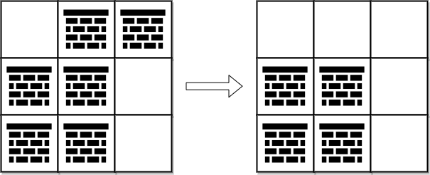
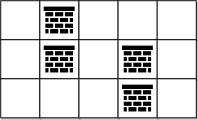

#广度优先搜索 #图 #数组 #矩阵 #最短路 #堆（优先队列） 
```button
name <font color="#548dd4">nvim打开</font>
type link
action file:///E%3A%5CDocuments%5CObsidian_%5CCpp%5CLeetcode%5C2375.%E5%88%B0%E8%BE%BE%E8%A7%92%E8%90%BD%E9%9C%80%E8%A6%81%E7%A7%BB%E9%99%A4%E9%9A%9C%E7%A2%8D%E7%89%A9%E7%9A%84%E6%9C%80%E5%B0%8F%E6%95%B0%E7%9B%AE.cpp
```
```button
name <font color="#4e937a">VSCode打开</font>
type link
action file:///code%20%22E%3A%5CDocuments%5CObsidian_%5CCpp%5CLeetcode%5C2375.%E5%88%B0%E8%BE%BE%E8%A7%92%E8%90%BD%E9%9C%80%E8%A6%81%E7%A7%BB%E9%99%A4%E9%9A%9C%E7%A2%8D%E7%89%A9%E7%9A%84%E6%9C%80%E5%B0%8F%E6%95%B0%E7%9B%AE.cpp%22
```

`button-anki-open`   `button-anki-update`

DECK: 面试题-hot100

## 0.1 2375.到达角落需要移除障碍物的最小数目

给你一个下标从 **0** 开始的二维整数数组 `grid` ，数组大小为 `m x n` 。每个单元格都是两个值之一：

- `0` 表示一个 **空** 单元格，
- `1` 表示一个可以移除的 **障碍物** 。

你可以向上、下、左、右移动，从一个空单元格移动到另一个空单元格。

现在你需要从左上角 `(0, 0)` 移动到右下角 `(m - 1, n - 1)` ，返回需要移除的障碍物的 **最小** 数目。

**示例 1：**



**输入：**grid = [[0,1,1],[1,1,0],[1,1,0]]
**输出：**2
**解释：**可以移除位于 (0, 1) 和 (0, 2) 的障碍物来创建从 (0, 0) 到 (2, 2) 的路径。
可以证明我们至少需要移除两个障碍物，所以返回 2 。
注意，可能存在其他方式来移除 2 个障碍物，创建出可行的路径。

**示例 2：**



**输入：**grid = [[0,1,0,0,0],[0,1,0,1,0],[0,0,0,1,0]]
**输出：**0
**解释：**不移除任何障碍物就能从 (0, 0) 到 (2, 4) ，所以返回 0 。

**提示：**

- `m == grid.length`
- `n == grid[i].length`
- `1 <= m, n <= 105`
- `2 <= m * n <= 105`
- `grid[i][j]` 为 `0` **或** `1`
- `grid[0][0] == grid[m - 1][n - 1] == 0`

## 0.2 Notes
1. 这题需要注意 popleft 方向不要错了，不要写成 pop
2. 然后就是方向是走四个方向，不用担心超市啥的，因为你有 visit 数组限制


## 0.3 Solution 
```python
class Solution:
    def minimumObstacles(self, grid: List[List[int]]) -> int:
        # 通过最小堆加入左边加边权0, 右边加边权1
        n, m = len(grid), len(grid[0])
        dq = deque()
        dq.appendleft((0, 0, 0)) # r, c, cnt
        visit = [[False] * m for _ in range(n)]

        legal = lambda i, j : 0 <= i < n and 0 <= j < m

        while dq:
            # BUG: 一开始popleft错了
            r, c, cnt = dq.popleft()
            # NEW: 如果访问过直接出去
            if visit[r][c]: 
                continue
            visit[r][c] = True

            if r == n - 1 and c == m - 1:
                return cnt

            for dr, dc in [[1, 0], [0, 1], [-1, 0], [0, -1]]: # NEW: 四个方向
                nr, nc = r + dr, c + dc
                if legal(nr, nc) and not visit[nr][nc]:
                    if grid[nr][nc] == 0:
                        dq.appendleft((nr, nc, cnt))
                        # 没有添加障碍物，优先级高
                    else:
                        # 新加了一个障碍物，优先级低
                        dq.append((nr, nc, cnt + 1))


```

![[2375.到达角落需要移除障碍物的最小数目.cpp]]

END
