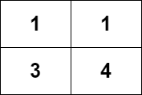

#深度优先搜索 #广度优先搜索 #图 #拓扑排序 #记忆化 #数组 #动态规划 #矩阵 
```button
name <font color="#548dd4">nvim打开</font>
type link
action file:///E%3A%5CDocuments%5CObsidian_%5CCpp%5CLeetcode%5C2409.%E7%BD%91%E6%A0%BC%E5%9B%BE%E4%B8%AD%E9%80%92%E5%A2%9E%E8%B7%AF%E5%BE%84%E7%9A%84%E6%95%B0%E7%9B%AE.cpp
```
```button
name <font color="#4e937a">VSCode打开</font>
type link
action file:///code%20%22E%3A%5CDocuments%5CObsidian_%5CCpp%5CLeetcode%5C2409.%E7%BD%91%E6%A0%BC%E5%9B%BE%E4%B8%AD%E9%80%92%E5%A2%9E%E8%B7%AF%E5%BE%84%E7%9A%84%E6%95%B0%E7%9B%AE.cpp%22
```

`button-anki-open`   `button-anki-update`

DECK: 面试题-hot100

## 0.1 2409.网格图中递增路径的数目

给你一个 `m x n` 的整数网格图 `grid` ，你可以从一个格子移动到 `4` 个方向相邻的任意一个格子。

请你返回在网格图中从 **任意** 格子出发，达到 **任意** 格子，且路径中的数字是 **严格递增** 的路径数目。由于答案可能会很大，请将结果对 `109 + 7` **取余** 后返回。

如果两条路径中访问过的格子不是完全相同的，那么它们视为两条不同的路径。

**示例 1：**



**输入：**grid = [[1,1],[3,4]]
**输出：**8
**解释：**严格递增路径包括：
- 长度为 1 的路径：[1]，[1]，[3]，[4] 。
- 长度为 2 的路径：[1 -> 3]，[1 -> 4]，[3 -> 4] 。
- 长度为 3 的路径：[1 -> 3 -> 4] 。
路径数目为 4 + 3 + 1 = 8 。

**示例 2：**

**输入：**grid = [[1],[2]]
**输出：**3
**解释：**严格递增路径包括：
- 长度为 1 的路径：[1]，[2] 。
- 长度为 2 的路径：[1 -> 2] 。
路径数目为 2 + 1 = 3 。

**提示：**

- `m == grid.length`
- `n == grid[i].length`
- `1 <= m, n <= 1000`
- `1 <= m * n <= 105`
- `1 <= grid[i][j] <= 105`

## 0.2 Notes

**核心思路：按值降序处理 + DP**

这道题要求统计网格中所有严格递增路径的数目。观察可以发现一个关键性质：**路径必须严格递增，因此值较小的格子的 DP 值依赖于值较大的格子的 DP 值**（只有值更大的邻居才能作为"下一步"）。

基于这个性质，我们采用如下策略：

1. **将所有格子按值从大到小排序**。这样优先处理值大的格子。
2. **DP 定义**：`dp[i][j]` 表示以 `(i, j)` 为起点的严格递增路径数目。初始值为 1（即单格路径）。
3. **遍历排序后的格子**：对当前格子 `(i, j)`，查看其四个方向的邻居 `(ni, nj)`。如果邻居的值 `> grid[i][j]`（即可以走向邻居），则将邻居的 dp 值累加到当前格子：
   $$dp[i][j] = 1 + \sum_{(ni,nj)} dp[ni][nj] \quad (\text{其中 } grid[ni][nj] > grid[i][j])$$
4. **正确性保证**：由于我们按值从大到小处理，当遍历到值较小的格子时，所有值比它大的邻居的 dp 值已经全部计算完毕，依赖关系得到满足。

最终答案即为所有格子的 dp 值之和。

> 对比常规的记忆化 DFS（自顶向下），这种方法相当于自底向上的 DP，通过排序明确了计算顺序，避免了递归开销。


## 0.3 Solution 
```python
class Solution:
    def countPaths(self, grid: List[List[int]]) -> int:
        MOD = 10**9 + 7
        m, n = len(grid), len(grid[0])
        
        # 把所有格子按值从大到小排序
        cells = []
        for i in range(m):
            for j in range(n):
                cells.append((grid[i][j], i, j))
        cells.sort(reverse=True)  # 从大到小
        
        dp = [[1] * n for _ in range(m)]  # 每个格子至少有1条路径（自身）
        directions = [(0,1),(0,-1),(1,0),(-1,0)]
        
        ans = 0
        for val, i, j in cells:
            for di, dj in directions:
                ni, nj = i + di, j + dj
                if 0 <= ni < m and 0 <= nj < n and grid[ni][nj] > val:
                    dp[i][j] = (dp[i][j] + dp[ni][nj]) % MOD
            ans = (ans + dp[i][j]) % MOD
        
        return ans
```


![[2409.网格图中递增路径的数目.cpp]]

END
