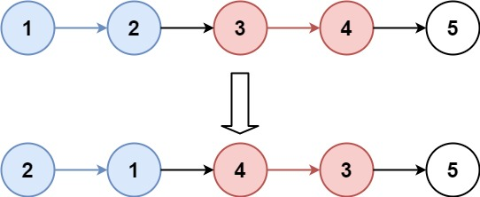

#递归 #链表 
```button
name <font color="#548dd4">nvim打开</font>
type link
action file:///E%3A%5CDocuments%5CObsidian_%5CCpp%5CLeetcode%5C25.K%20%E4%B8%AA%E4%B8%80%E7%BB%84%E7%BF%BB%E8%BD%AC%E9%93%BE%E8%A1%A8.cpp
```
```button
name <font color="#4e937a">VSCode打开</font>
type link
action file:///code%20%22E%3A%5CDocuments%5CObsidian_%5CCpp%5CLeetcode%5C25.K%20%E4%B8%AA%E4%B8%80%E7%BB%84%E7%BF%BB%E8%BD%AC%E9%93%BE%E8%A1%A8.cpp%22
```

`button-anki-open`   `button-anki-update`

DECK: 面试题-hot100

## 0.1 25.K 个一组翻转链表

给你链表的头节点 `head` ，每 `k` 个节点一组进行翻转，请你返回修改后的链表。

`k` 是一个正整数，它的值小于或等于链表的长度。如果节点总数不是 `k` 的整数倍，那么请将最后剩余的节点保持原有顺序。

你不能只是单纯的改变节点内部的值，而是需要实际进行节点交换。

**示例 1：**



**输入：**head = [1,2,3,4,5], k = 2
**输出：**[2,1,4,3,5]

**示例 2：**


**输入：**head = [1,2,3,4,5], k = 3
**输出：**[3,2,1,4,5]

**提示：**

- 链表中的节点数目为 `n`
- `1 <= k <= n <= 5000`
- `0 <= Node.val <= 1000`

**进阶：**你可以设计一个只用 `O(1)` 额外内存空间的算法解决此问题吗？

## 0.2 Notes
TODO:
1. Tie 有什么作用?
   `tie` 是 `<tuple>` 头文件中提供的函数，它的核心作用是：**创建一个由变量引用组成的 “临时元组”，可以直接接收另一个元组（或 pair）的赋值，实现多变量的批量赋值**。
   简单来说：如果一个函数返回 `pair<A, B>`（比如你的 `myReverse` 返回 `pair<ListNode*, ListNode*>`），`tie` 可以让你不用手动拆 `first` 和 `second`，而是直接把两个值赋给两个变量。

## 0.3 Solution 

### 0.3.1 简洁版
```cpp
class Solution {
public:
    // 翻转一个子链表，并且返回新的头与尾
    pair<ListNode*, ListNode*> myReverse(ListNode* head, ListNode* tail) {
        ListNode* prev = tail->next;
        ListNode* p = head;
        while (prev != tail) {
            ListNode* nex = p->next;
            p->next = prev;
            prev = p;
            p = nex;
        }
        return {tail, head};
    }

    ListNode* reverseKGroup(ListNode* head, int k) {
        ListNode* hair = new ListNode(0);
        hair->next = head;
        ListNode* pre = hair;

        while (head) {
            ListNode* tail = pre;
            // 查看剩余部分长度是否大于等于 k
            for (int i = 0; i < k; ++i) {
                tail = tail->next;
                if (!tail) {
                    return hair->next;
                }
            }
            ListNode* nex = tail->next;
            // 这里是 C++17 的写法，也可以写成
            // pair<ListNode*, ListNode*> result = myReverse(head, tail);
            // head = result.first;
            // tail = result.second;
            tie(head, tail) = myReverse(head, tail);
            // 把子链表重新接回原链表
            pre->next = head;
            tail->next = nex;
            pre = tail;
            head = tail->next;
        }

        return hair->next;
    }
};
```

### 0.3.2 原来的版本
```cpp
class Solution {
public:
    ListNode* reverseKGroup(ListNode* head, int k) {
        // 存储每k个节点的头部head, 断开后面的连接
        vector<pair<ListNode*, int>> heads;
        ListNode *cur = head, *pre = nullptr;
        for (int cnt = 0; cur; pre = cur, cur = cur->next, cnt++) {
            if (cnt % k == 0) { 
                // 断开后面的连接
                if (pre) pre->next = nullptr;
                heads.push_back({cur, 0});
            }
            heads.back().second++;
        }

        vector<pair<ListNode*, int>> tails(heads.begin(), heads.end());

        // 翻转每k个节点, 同时将head置为原来的tail
        for (int i = 0; i < heads.size(); i++) {
            if (heads[i].second == k) {
                // 将head置为原来的tail, tail置为原来的head
                tails[i].first = heads[i].first;
                heads[i].first = reverseAndReturnTail(heads[i].first);
            }
        }

        // 将所有链表连接起来
        for (int i = 0; i < heads.size() - 1; i++) {
            tails[i].first->next = heads[i + 1].first;
        }

        return heads[0].first;
    }

    ListNode* reverseAndReturnTail(ListNode* head) {
        ListNode *cur = head, *pre = nullptr, *nxt = nullptr;
        while (cur) {
            nxt = cur->next;

            cur->next = pre;

            pre = cur;
            cur = nxt;
        } // cur == nullptr, pre == tail
        return pre;
    }
};
```


END
<!--ID: 1773973207753-->
