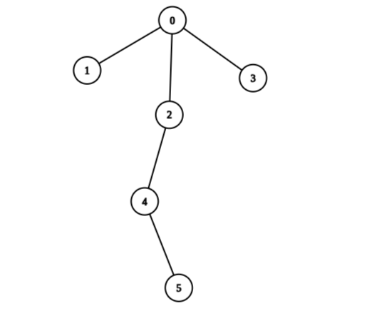
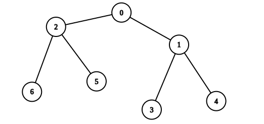

#树 #深度优先搜索 #动态规划 #树形 DP 
```button
name <font color="#548dd4">nvim打开</font>
type link
action file:///E%3A%5CDocuments%5CObsidian_%5CCpp%5CLeetcode%5C3191.%E5%9C%A8%E6%A0%91%E4%B8%8A%E6%89%A7%E8%A1%8C%E6%93%8D%E4%BD%9C%E4%BB%A5%E5%90%8E%E5%BE%97%E5%88%B0%E7%9A%84%E6%9C%80%E5%A4%A7%E5%88%86%E6%95%B0.cpp
```
```button
name <font color="#4e937a">VSCode打开</font>
type link
action file:///code%20%22E%3A%5CDocuments%5CObsidian_%5CCpp%5CLeetcode%5C3191.%E5%9C%A8%E6%A0%91%E4%B8%8A%E6%89%A7%E8%A1%8C%E6%93%8D%E4%BD%9C%E4%BB%A5%E5%90%8E%E5%BE%97%E5%88%B0%E7%9A%84%E6%9C%80%E5%A4%A7%E5%88%86%E6%95%B0.cpp%22
```

`button-anki-open`   `button-anki-update`

DECK: 面试题-hot100

## 0.1 3191.在树上执行操作以后得到的最大分数

有一棵 `n` 个节点的无向树，节点编号为 `0` 到 `n - 1` ，根节点编号为 `0` 。给你一个长度为 `n - 1` 的二维整数数组 `edges` 表示这棵树，其中 `edges[i] = [ai, bi]` 表示树中节点 `ai` 和 `bi` 有一条边。

同时给你一个长度为 `n` 下标从 **0** 开始的整数数组 `values` ，其中 `values[i]` 表示第 `i` 个节点的值。

一开始你的分数为 `0` ，每次操作中，你将执行：

- 选择节点 `i` 。
- 将 `values[i]` 加入你的分数。
- 将 `values[i]` 变为 `0` 。

如果从根节点出发，到任意叶子节点经过的路径上的节点值之和都不等于 0 ，那么我们称这棵树是 **健康的** 。

你可以对这棵树执行任意次操作，但要求执行完所有操作以后树是 **健康的** ，请你返回你可以获得的 **最大分数** 。

**示例 1：**



**输入：**edges = [[0,1],[0,2],[0,3],[2,4],[4,5]], values = [5,2,5,2,1,1]
**输出：**11
**解释：**我们可以选择节点 1 ，2 ，3 ，4 和 5 。根节点的值是非 0 的。所以从根出发到任意叶子节点路径上节点值之和都不为 0 。所以树是健康的。你的得分之和为 values[1] + values[2] + values[3] + values[4] + values[5] = 11 。
11 是你对树执行任意次操作以后可以获得的最大得分之和。

**示例 2：**



**输入：**edges = [[0,1],[0,2],[1,3],[1,4],[2,5],[2,6]], values = [20,10,9,7,4,3,5]
**输出：**40
**解释：**我们选择节点 0 ，2 ，3 和 4 。
- 从 0 到 4 的节点值之和为 10 。
- 从 0 到 3 的节点值之和为 10 。
- 从 0 到 5 的节点值之和为 3 。
- 从 0 到 6 的节点值之和为 5 。
所以树是健康的。你的得分之和为 values[0] + values[2] + values[3] + values[4] = 40 。
40 是你对树执行任意次操作以后可以获得的最大得分之和。

**提示：**

- `2 <= n <= 2 * 104`
- `edges.length == n - 1`
- `edges[i].length == 2`
- `0 <= ai, bi < n`
- `values.length == n`
- `1 <= values[i] <= 109`
- 输入保证 `edges` 构成一棵合法的树。

## 0.2 Notes

### 0.2.1 题意转化：操作 = 选节点，健康 = 每条根→叶路径上有「非零节点」

- 一次操作 = 选择一个节点 `i`，得分 `+values[i]`，并把 `values[i]` 置 0。
- 由于 `values[i] >= 1`，操作全部结束后：==节点没被选 ⟺ 它的值仍 > 0==；被选 ⟺ 已经变成 0。
- 「健康」的定义是每条 根→叶 路径上 ==节点值之和 ≠ 0==。只要路径上有一个非零值，和就一定不为 0，所以这等价于：==每条 根→叶 路径上至少有一个节点没被选==。

> 于是「选哪些节点」和「哪些节点留作非零」是一一对应的：设未选节点集合为 `U`，则树健康 ⟺ 每条 根→叶 路径都穿过 `U`（即 `U` 是这棵树的一个「根—叶割」）。

### 0.2.2 目标转化：最大得分 = 总和 − 最小未选代价

总分是固定的 `sum(values)`，被选走的部分就是得分，没被选走的部分就是代价：

> 最大得分 = `sum(values)` − min(未选节点的值之和)

问题因此变成：==找一个未选节点集合 `U`，使每条 根→叶 路径都至少覆盖到 `U` 中的一个节点，且 `U` 的权值和最小==。

> 根节点也在 `U` 的候选里：样例 2 中根 0 反而被"选"了，因为把它当作未选节点代价要 20，太贵；换成两个孩子各自解决只要 10 + 8 = 18。

### 0.2.3 树形 DP

`dp[u]` 定义（自底向上）：以 `u` 为根的子树中，保证「从 `u` 到子树内任意叶子」的路径上都有未选节点时，==未选节点值之和的最小值==。

转移：

| 情况 | 决策 | `dp[u]` |
| --- | --- | --- |
| `u` 是叶子 | ==必须不选 `u`==，否则这条路径被选空 | `values[u]` |
| `u` 非叶子 | ==不选 `u`==：`u` 自己就挡住了往下所有路径，孩子随意 | `values[u]` |
| `u` 非叶子 | ==选 `u`==：`u` 变 0 挡不住，每个孩子子树要各自独立满足 | `Σ dp[v]` |

> `dp[u] = min(values[u], Σ dp[v])`，答案 = `sum(values) - dp[0]`。

关于「叶子」的判断：这是一棵 ==无向树 + 以 0 为根==，所谓叶子要按「去掉父节点后还有没有孩子」来判，而不是看度数。代码里用 `for v in g[u]: if v == parent: continue` 数孩子，正是在做这件事（`n = 1` 时根 0 也是叶子，此时 dp = `values[0]`，答案 0，符合题意）。

### 0.2.4 复杂度

- 时间：==O(n)==，每个节点只被访问一次
- 空间：==O(n)==，邻接表 + 递归栈

> Python 注意点：`n` 最大 `2 * 10^4`，若树退化成链，递归深度 = `n`，==默认递归上限 1000 会直接 RecursionError==，需要 `sys.setrecursionlimit(10**5)`，或改写成显式栈的迭代后序遍历。
> 另外 `@cache` 在这里其实不是必需的：树上每个节点只有一个父节点，`dfs(u, parent)` 每个状态只会被调用一次，记忆化主要是防止重复；也可以只按 `u` 记忆化，或干脆去掉。

## 0.3 Solution 

**解法一：树形 DP（最小未选代价）—— 本笔记做法**

```python
from typing import List

class Solution:
    def maximumScoreAfterOperations(self, edges: List[List[int]], values: List[int]) -> int:
        n = len(values)
        g = [[] for _ in range(n)]
        for a, b in edges:
            g[a].append(b)
            g[b].append(a)
        
        total = sum(values)
        INF = 10**18
        
        @cache
        def dfs(u: int, parent: int) -> int:
            # 返回 dp[u]：以 u 为根的子树中，保证从 u 到叶子路径上有未选节点的最小未选代价
            child_sum = 0
            is_leaf = True
            for v in g[u]:
                if v == parent:
                    continue
                is_leaf = False
                child_sum += dfs(v, u)
            
            if is_leaf:
                # 叶子必须不选自己
                return values[u]
            else:
                # 不选自己，或选自己但每个孩子子树自己解决
                return min(values[u], child_sum)
        
        min_unselected = dfs(0, -1)
        return total - min_unselected
```

![[3191.在树上执行操作以后得到的最大分数.cpp]]

END
