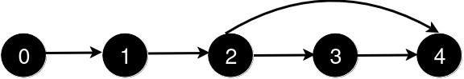
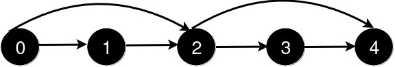
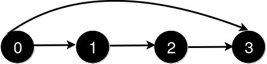

#广度优先搜索 #图 #数组 
```button
name <font color="#548dd4">nvim打开</font>
type link
action file:///E%3A%5CDocuments%5CObsidian_%5CCpp%5CLeetcode%5C3517.%E6%96%B0%E5%A2%9E%E9%81%93%E8%B7%AF%E6%9F%A5%E8%AF%A2%E5%90%8E%E7%9A%84%E6%9C%80%E7%9F%AD%E8%B7%9D%E7%A6%BB%20I.cpp
```
```button
name <font color="#4e937a">VSCode打开</font>
type link
action file:///code%20%22E%3A%5CDocuments%5CObsidian_%5CCpp%5CLeetcode%5C3517.%E6%96%B0%E5%A2%9E%E9%81%93%E8%B7%AF%E6%9F%A5%E8%AF%A2%E5%90%8E%E7%9A%84%E6%9C%80%E7%9F%AD%E8%B7%9D%E7%A6%BB%20I.cpp%22
```

`button-anki-open`   `button-anki-update`

DECK: 面试题-hot100

## 0.1 3517.新增道路查询后的最短距离 I

给你一个整数 `n` 和一个二维整数数组 `queries`。

有 `n` 个城市，编号从 `0` 到 `n - 1`。初始时，每个城市 `i` 都有一条**单向**道路通往城市 `i + 1`（ `0 <= i < n - 1`）。

`queries[i] = [ui, vi]` 表示新建一条从城市 `ui` 到城市 `vi` 的**单向**道路。每次查询后，你需要找到从城市 `0` 到城市 `n - 1` 的**最短路径**的**长度**。

返回一个数组 `answer`，对于范围 `[0, queries.length - 1]` 中的每个 `i`，`answer[i]` 是处理完**前** `i + 1` 个查询后，从城市 `0` 到城市 `n - 1` 的最短路径的_长度_。

**示例 1：**

**输入：** n = 5, queries = [[2, 4], [0, 2], [0, 4]]

**输出：** [3, 2, 1]

**解释：**



新增一条从 2 到 4 的道路后，从 0 到 4 的最短路径长度为 3。



新增一条从 0 到 2 的道路后，从 0 到 4 的最短路径长度为 2。


新增一条从 0 到 4 的道路后，从 0 到 4 的最短路径长度为 1。

**示例 2：**

**输入：** n = 4, queries = [[0, 3], [0, 2]]

**输出：** [1, 1]

**解释：**



新增一条从 0 到 3 的道路后，从 0 到 3 的最短路径长度为 1。


新增一条从 0 到 2 的道路后，从 0 到 3 的最短路径长度仍为 1。

**提示：**

- `3 <= n <= 500`
- `1 <= queries.length <= 500`
- `queries[i].length == 2`
- `0 <= queries[i][0] < queries[i][1] < n`
- `1 < queries[i][1] - queries[i][0]`
- 查询中没有重复的道路。

## 0.2 Notes

### 0.2.1 题目建模

- 初始图是一条链：`i -> i+1`；每次查询 ==只增边、不删边==，所以图可以增量维护，不用每次重建。
- ==所有边的权值都是 1== ⇒ 最短路径长度就是 BFS 从 0 到 `n-1` 的层数，不需要 Dijkstra / 优先队列。

### 0.2.2 核心思路：加一条边，重跑一次 BFS

1. 用邻接表 `graph` 存图，初始化 `graph[i] = [i+1]`；
2. 每处理一个查询 `(u, v)`：先把新边 `graph[u].append(v)` 加进图，再从 0 出发跑一次 BFS，把 `dist[n-1]` 计入答案；
3. BFS 中用 `dist[v] == -1` 判重 ⇒ ==每个点最多入队一次==，单次 BFS 为 $O(n + m)$；
4. 因为边只会增加，最短距离 ==单调不增==，但本做法不做增量复用，每次都是全新一轮 BFS。

### 0.2.3 复杂度

| 解法 | 时间复杂度 | 空间复杂度 | 说明 |
| --- | --- | --- | --- |
| 每次加边后重跑 BFS（本笔记做法） | $O(Q \cdot (n + m))$，$m = O(n + Q)$ | $O(n + Q)$ | 本题 $n, Q \le 500$，最坏约 $500 \times 1000$，足够 |
| 区间合并 + 有序集合跳点 | $O((n + Q) \log n)$ | $O(n)$ | 加强版 3243 的正解 |

> 本做法能过完全是因为数据范围小（$n, Q \le 500$）。加强版 [[3243.新增道路查询后的最短距离 II]] 的 $n, Q$ 可达 $10^5$，必须换成下面的均摊做法。

## 0.3 Solution 
**解法一：每次加边后重跑 BFS —— 本笔记做法**

```python
from collections import deque

class Solution:
    def shortestDistanceAfterQueries(self, n: int, queries: List[List[int]]) -> List[int]:
        # 初始图：i -> i+1
        graph = [[] for _ in range(n)]
        for i in range(n - 1):
            graph[i].append(i + 1)

        def bfs():
            dist = [-1] * n
            dist[0] = 0
            q = deque([0])

            while q:
                u = q.popleft()
                if u == n - 1:
                    return dist[u]
                for v in graph[u]:
                    if dist[v] == -1:
                        dist[v] = dist[u] + 1
                        q.append(v)

            return dist[n - 1]

        ans = []
        for u, v in queries:
            graph[u].append(v)
            ans.append(bfs())

        return ans
```

![[3517.新增道路查询后的最短距离 I.cpp]]

END
