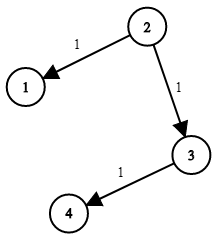

#图 #最短路 #Dijkstra #堆 

<!-- 点击自动创建文件 + 打开 Neovim -->
```button
name <font color="#548dd4">打开nvim（自动创建.cpp）</font>
type link
action file:///E%3A%5CDocuments%5CObsidian_%5C%E8%AE%A1%E7%BD%91%5CLeetcode%5C744.%20%E7%BD%91%E7%BB%9C%E5%BB%B6%E8%BF%9F%E6%97%B6%E9%97%B4.cpp
```
```button
name <font color="#6aa84f">刷新Solution代码</font>
type link
action obsidian://advanced-uri?command=templater%3Aexecute-script&script=%0A%20%20(async%20(tp)%20%3D%3E%20%7B%0A%20%20%20%20const%20fs%20%3D%20require('fs')%3B%0A%20%20%20%20const%20path%20%3D%20require('path')%3B%0A%20%20%20%20const%20targetFile%20%3D%20tp.config.target_file%3B%0A%20%20%20%20const%20cppFilePath%20%3D%20path.join(%0A%20%20%20%20%20%20targetFile.vault.adapter.basePath%2C%0A%20%20%20%20%20%20targetFile.parent.path%2C%0A%20%20%20%20%20%20%60%24%7BtargetFile.basename%7D.cpp%60%0A%20%20%20%20)%3B%0A%0A%20%20%20%20try%20%7B%0A%20%20%20%20%20%20%2F%2F%20%E8%AF%BB%E5%8F%96%E7%AC%94%E8%AE%B0%E5%86%85%E5%AE%B9%E5%92%8C%20cpp%20%E6%96%87%E4%BB%B6%E5%86%85%E5%AE%B9%0A%20%20%20%20%20%20const%20noteContent%20%3D%20await%20tp.file.content()%3B%0A%20%20%20%20%20%20let%20cppContent%20%3D%20fs.readFileSync(cppFilePath%2C%20'utf-8').trim()%20%7C%7C%20%22%2F%2F%20%E6%9A%82%E6%97%A0%E4%BB%A3%E7%A0%81%E5%AE%9E%E7%8E%B0%22%3B%0A%0A%20%20%20%20%20%20%2F%2F%20%E6%9B%BF%E6%8D%A2%20Solution%20%E9%83%A8%E5%88%86%E5%86%85%E5%AE%B9%0A%20%20%20%20%20%20const%20updatedContent%20%3D%20noteContent.replace(%0A%20%20%20%20%20%20%20%20%2F(%23%23%20Solution%5Cn%5Cn)(%5B%5Cs%5CS%5D*%3F)(%3F%3D%5CnEND)%2F%2C%0A%20%20%20%20%20%20%20%20(match%2C%20solutionTitle)%20%3D%3E%20%7B%0A%20%20%20%20%20%20%20%20%20%20return%20%60%24%7BsolutionTitle%7D%60%60cpp%0A%24%7BcppContent%7D%0A%60%60%60%3B%0A%20%20%20%20%20%20%20%20%7D%0A%20%20%20%20%20%20)%3B%0A%0A%0A%20%20%20%20%20%20await%20tp.file.modify(updatedContent)%3B%0A%20%20%20%20%20%20new%20Notice(%22%E2%9C%85%20Solution%20%E5%88%B7%E6%96%B0%E6%88%90%E5%8A%9F%EF%BC%81%22)%3B%0A%20%20%20%20%7D%20catch%20(error)%20%7B%0A%20%20%20%20%20%20console.error(%22%E5%88%B7%E6%96%B0%E5%A4%B1%E8%B4%A5%EF%BC%9A%22%2C%20error)%3B%0A%20%20%20%20%20%20new%20Notice(%60%E2%9D%8C%20%E5%88%B7%E6%96%B0%E5%A4%B1%E8%B4%A5%EF%BC%9A%24%7Berror.message%7D%60)%3B%0A%20%20%20%20%7D%0A%20%20%7D)(tp)%3B%20%2F%2F%20%E4%BC%A0%E9%80%92%20tp%20%E5%AF%B9%E8%B1%A1%E5%88%B0%E8%84%9A%E6%9C%AC%E4%B8%AD%0A
```

`button-anki-open`   `button-anki-update`

DECK: 面试题-hot100

## 0.1 744. 网络延迟时间

有 `n` 个网络节点，标记为 `1` 到 `n`。

给你一个列表 `times`，表示信号经过 **有向** 边的传递时间。 `times[i] = (ui, vi, wi)`，其中 `ui` 是源节点，`vi` 是目标节点， `wi` 是一个信号从源节点传递到目标节点的时间。

现在，从某个节点 `K` 发出一个信号。需要多久才能使所有节点都收到信号？如果不能使所有节点收到信号，返回 `-1` 。

**示例 1：**



**输入：**times = [[2,1,1],[2,3,1],[3,4,1]], n = 4, k = 2
**输出：**2

**示例 2：**

**输入：**times = [[1,2,1]], n = 2, k = 1
**输出：**1

**示例 3：**

**输入：**times = [[1,2,1]], n = 2, k = 2
**输出：**-1

**提示：**

- `1 <= k <= n <= 100`
- `1 <= times.length <= 6000`
- `times[i].length == 3`
- `1 <= ui, vi <= n`
- `ui != vi`
- `0 <= wi <= 100`
- 所有 `(ui, vi)` 对都 **互不相同**（即，不含重复边）

## 0.2 Notes

### 0.2.1 本质

**单源最短路 + 边权非负** → 直接套 ==Dijkstra + 小根堆==（本题就是模板题：源点 `k`，求 `k` 到所有点的最短距离）。硬条件只有「边权非负」，和有向 / 无向无关——无向图把每条边拆成两条等权反向有向边即可，本题给的就是有向边。

### 0.2.2 模板骨架：两个数组 + 一个小根堆

- `distance[i]`：源点到 i 的当前最短距离，初值 `+∞`，`distance[源点] = 0`
- `visited[i]`：i 是否已从小根堆**弹出过**（弹出即定案）
- 小根堆里存 `(点, 源点到该点的距离)`，按距离排序

流程：

1. `distance[源点] = 0`，把 `(源点, 0)` 放进小根堆
2. 弹出堆顶 `(u, d)`：
   - `visited[u] == true` → ==过期记录，直接跳过==
   - `visited[u] == false` → 令 `visited[u] = true`，再用 u 松弛每一条出边 `u → v`（权 w）：若 `!visited[v] && d + w < distance[v]`，则 `distance[v] = d + w`，并把 `(v, distance[v])` 放进堆
3. 堆空结束，`distance` 表就是源点到各点的最短路

> [!note] 一句话记法
> ==小根堆负责「每次取当前最近的未定案点」，`visited` 负责「一个点只定案一次」。==

### 0.2.3 为什么堆顶一定是最短路（也就为什么边权不能为负）

设出堆的点为 u、距离为 d，此刻 d 已是堆中最小的。反证：若存在一条到 u 的更短路，长为 `L < d`；沿这条路走，令 y 是路上第一个还没定案的点，x 是它的前驱（x 已定案，`distance[x]` 已是真值）。由于边权非负：

> `distance[y] ≤ distance[x] + w(x, y) ≤ L < d`

于是堆里存在一个距离比 `d` 更小的点 y，与「u 是堆顶」矛盾。故 d 就是最短路。
反过来，==一旦有负权边，上面这段推理立刻失效==，算法就不对了（负权图要用 Bellman-Ford / SPFA）。

### 0.2.4 本题特有的收尾（模板之外的部分）

> [!important] 原笔记
> ==后面是这道题的要求，正常情况下我们需要的就是 s 到 n 的距离就是 `distance[n]`，或者说你需要路径的话, 就是要添加一个数组 path, 在每次更新距离的时候加入一句 `path[v] = u`, 表示路径是从 u 那里继承过来的==

- 本题要的是「信号传遍所有节点」的时间 = 所有点最短路里的**最大值** → `max(distance[1..n])`
- 只要有点不可达（`distance[i] == INT_MAX`）就返回 `-1`
- 一句话：==模板给的是 `distance` 表，`max` / `-1` 是本题额外加的两步。==

### 0.2.5 复杂度

| 项 | 复杂度 | 说明 |
| --- | --- | --- |
| 时间 | `O(m log m)` | m 为边数；每个点 / 边最多入堆一次，每次堆操作 `log m` |
| 空间 | `O(n + m)` | 距离表 + 访问表 + 邻接表 + 小根堆 |

## 0.3 Solution 
**解法一：模板写法（`pair` + `greater<>` 小根堆）—— 本笔记主解法**

```cpp
class Solution {
private:
    vector<vector<pair<int, int>>> g;

public:
    void build(vector<vector<int>>& times, int n) {
        g.assign(n + 1, vector<pair<int, int>>{});
        for (auto &time : times) {
            auto u = time[0], v = time[1], w = time[2];
            g[u].push_back({v, w});
        }
    }

    int networkDelayTime(vector<vector<int>>& times, int n, int k) {
        build(times, n);

        // g[u] = {(v, w), ...}，点编号 1 ~ n
        vector<int> dist(n + 1, INT_MAX);
        vector<bool> visited(n + 1, false);
        // 小根堆，按距离升序
        priority_queue<pair<int, int>, vector<pair<int, int>>, greater<>> heap;

        int start = k;
        dist[start] = 0;
        heap.push({0, start});
        while (!heap.empty()) {
            auto [d, u] = heap.top(); heap.pop();
            if (visited[u]) continue;   // 一个点可能被压入多次，旧的记录直接跳过
            visited[u] = true;          // 出堆即定案，d 就是 start→u 的最短路
            for (auto [v, w] : g[u]) {
                if (!visited[v] && d + w < dist[v]) {
                    dist[v] = d + w;
                    heap.push({dist[v], v});
                }
            }
        }

        // 本题要求：所有点都收到信号 → 取全部最短距离的最大值；有不可达点则返回 -1
        int ans = *max_element(dist.begin() + 1, dist.end());
        return ans == INT_MAX ? -1 : ans;
    }
};
```

**解法二：`array<int, 2>` + lambda 比较器写法（同一算法，只是堆的比较器写法不同）**

```cpp
#include <bits/stdc++.h>
#include <climits>
#include <queue>
using namespace std;

typedef array<int, 2> aii;

// Dijkstra算法模版
class Solution {
public:
    int networkDelayTime(vector<vector<int>>& times, int n, int s) {
        vector<vector<aii>> graph(n + 1, vector<aii>());
        for (const auto &edge : times) {
            graph[edge[0]].push_back({edge[1], edge[2]}); 
        }

        vector<int> distance(n + 1, INT_MAX);
        vector<bool> visited(n + 1, false);
        distance[s] = 0; // 初始自己的距离是0

        auto cmp = [](aii& a, aii& b) { return a[1] > b[1]; }; // 小根堆
        priority_queue<aii, vector<aii>, decltype(cmp)> pq(cmp);

        // 将初始的s加入pq, 距离为零
        pq.push({s, 0});
        while (!pq.empty()) {
            int u = pq.top()[0]; pq.pop(); // 自动选取权值最小的边
            if (visited[u]) {
                continue;
            }
            visited[u] = true;

            for (const auto &edge : graph[u]) {
                auto [v, w] = edge;
                if (!visited[v] && distance[u] + w < distance[v]) { // 如果值更小的话就更新
                    distance[v] = distance[u] + w; // 说明s到u再到v的路径比原先到v的路径更短
                    pq.push({v, distance[v]});
                }
            }
        }

		// 后面是这道题的要求，正常情况下我们需要的就是s到n的距离就是distance[n]，或者说你需要路径的话, 就是要添加一个数组path, 在每次更新距离的时候加入一句path[v] = u, 表示路径是从u那里继承过来的
        int ans = INT_MIN;
        // 寻找所有点中的距离最大值
        for (int i = 1; i <= n; i++) {
            if (distance[i] == INT_MAX) {
                return -1;
            }
            ans = max(ans, distance[i]);
        }
        return ans;
    }
};


```


![[744. 网络延迟时间.cpp]]


END
<!--ID: 1767522704342-->


