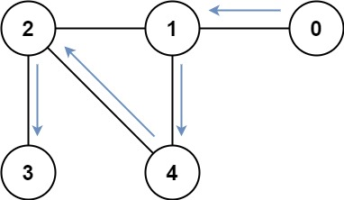

#位运算 #广度优先搜索 #图 #动态规划 #位掩码 
```button
name <font color="#548dd4">nvim打开</font>
type link
action file:///E%3A%5CDocuments%5CObsidian_%5CCpp%5CLeetcode%5C877.%E8%AE%BF%E9%97%AE%E6%89%80%E6%9C%89%E8%8A%82%E7%82%B9%E7%9A%84%E6%9C%80%E7%9F%AD%E8%B7%AF%E5%BE%84.cpp
```
```button
name <font color="#4e937a">VSCode打开</font>
type link
action file:///code%20%22E%3A%5CDocuments%5CObsidian_%5CCpp%5CLeetcode%5C877.%E8%AE%BF%E9%97%AE%E6%89%80%E6%9C%89%E8%8A%82%E7%82%B9%E7%9A%84%E6%9C%80%E7%9F%AD%E8%B7%AF%E5%BE%84.cpp%22
```

`button-anki-open`   `button-anki-update`

DECK: 面试题-hot100

## 0.1 877.访问所有节点的最短路径

存在一个由 `n` 个节点组成的无向连通图，图中的节点按从 `0` 到 `n - 1` 编号。

给你一个数组 `graph` 表示这个图。其中，`graph[i]` 是一个列表，由所有与节点 `i` 直接相连的节点组成。

返回能够访问所有节点的最短路径的长度。你可以在任一节点开始和停止，也可以多次重访节点，并且可以重用边。

**示例 1：**


**输入：**graph = [[1,2,3],[0],[0],[0]]
**输出：**4
**解释：**一种可能的路径为 [1,0,2,0,3]

**示例 2：**



**输入：**graph = [[1],[0,2,4],[1,3,4],[2],[1,2]]
**输出：**4
**解释：**一种可能的路径为 [0,1,4,2,3]

**提示：**

- `n == graph.length`
- `1 <= n <= 12`
- `0 <= graph[i].length < n`
- `graph[i]` 不包含 `i`
- 如果 `graph[a]` 包含 `b` ，那么 `graph[b]` 也包含 `a`
- 输入的图总是连通图

## 0.2 Notes

> [!note] 为什么这题特殊
> 这题是 **BFS + 状态压缩（位掩码）** 的组合。
> 以前一直把状态压缩和 DFS + 动态规划（状压 DP）绑定在一起，比如 TSP。
> 但这题是在 **BFS** 上用状态压缩——因为题目求"最短路径长度"，BFS 天然按层扩散、最先到达的一定最短。
> 所以状态压缩其实是一种通用的**状态表示思想**，可以和任意搜索算法结合，不一定要配 DP。

### 0.2.1 巧妙点 1：多源 BFS —— 每个节点都作为初始状态入队

题目允许"在任一节点开始"，但最优起点未知，所以**把所有节点都当成起点，同时入队**：

```python
q = deque((i, 1 << i, 0) for i in range(n))
```

- 每个起点都在第 0 层，BFS 按距离逐层推进，先"走满所有节点"的那条路径一定最短。
- 这是本题最关键的突破口：**把"选哪个起点"也交给 BFS 去搜索**，而不是预先猜一个起点。
- 也正是靠这个点，复杂度才能压到可接受的量级。

### 0.2.2 巧妙点 2：用 `(当前节点, mask)` 二元组做去重

- 状态定义为 `(u, mask)`：当前在节点 `u`，已访问节点集合是 `mask`。
- 同一个状态（同样的位置 + 同样的访问集合）再次出现时，后续只会走出**一样或更差**的路径，直接剪枝。
- `seen` 的初始值要和队列保持一致：

```python
seen = {(i, 1 << i) for i in range(n)}
```

- 没有去重的话，因为"边和节点都可以重复走"，BFS 会无限扩散；有了它，状态总数被限制在 $n \times 2^n$ 以内。

### 0.2.3 巧妙点 3：mask 满时直接返回

- BFS 队列按距离**非递减**出队，每扩展一层距离 +1。
- 因此第一次弹出的 `mask == (1 << n) - 1` 状态，对应的距离一定是全局最短。
- 命中即 break，不需要再往下搜。

### 0.2.4 时间复杂度推导：$O(n^2 \times 2^n)$

**状态数：**
- 状态 =（当前节点，已访问集合），当前节点有 $n$ 种，mask 有 $2^n$ 种
- → 总状态数 $n \times 2^n$

**每个状态的开销：**
- 每个状态最多出队一次（由 `seen` 集合保证不重复入队）
- 出队后要遍历当前节点的所有邻居；最坏情况是**完全图**，每个节点有 $n-1$ 个邻居，即 $O(n)$
- → 总时间 = 状态数 × 每状态枚举邻居数 $= O(n \times 2^n \times n) = O(n^2 \times 2^n)$

**为什么可接受：** $n \le 12$，$n^2 \times 2^n = 144 \times 4096 \approx 5.9 \times 10^5$，量级很小。

**空间复杂度：** `seen` 和队列最多存 $n \times 2^n$ 个状态，即 $O(n \times 2^n)$。

## 0.3 Solution 
```python
class Solution:
    def shortestPathLength(self, graph: List[List[int]]) -> int:
        n = len(graph)
        q = deque((i, 1 << i, 0) for i in range(n))
        seen = {(i, 1 << i) for i in range(n)}
        ans = 0
        
        while q:
            u, mask, dist = q.popleft()
            if mask == (1 << n) - 1:
                ans = dist
                break
            # 搜索相邻的节点
            for v in graph[u]:
                # 将 mask 的第 v 位置为 1
                mask_v = mask | (1 << v)
                if (v, mask_v) not in seen:
                    q.append((v, mask_v, dist + 1))
                    seen.add((v, mask_v))
        
        return ans
```


![[877.访问所有节点的最短路径.cpp]]

END
