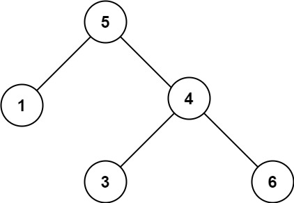

#树 #深度优先搜索 #二叉搜索树 #二叉树 
```button
name <font color="#548dd4">nvim打开</font>
type link
action file:///E%3A%5CDocuments%5CObsidian_%5CCpp%5CLeetcode%5C98.%E9%AA%8C%E8%AF%81%E4%BA%8C%E5%8F%89%E6%90%9C%E7%B4%A2%E6%A0%91.cpp
```
```button
name <font color="#4e937a">VSCode打开</font>
type link
action file:///code%20%22E%3A%5CDocuments%5CObsidian_%5CCpp%5CLeetcode%5C98.%E9%AA%8C%E8%AF%81%E4%BA%8C%E5%8F%89%E6%90%9C%E7%B4%A2%E6%A0%91.cpp%22
```

`button-anki-open`   `button-anki-update`

DECK: 面试题-hot100

## 0.1 98.验证二叉搜索树

给你一个二叉树的根节点 `root` ，判断其是否是一个有效的二叉搜索树。

**有效** 二叉搜索树定义如下：

- 节点的左子树只包含 **严格小于** 当前节点的数。
- 节点的右子树只包含 **严格大于** 当前节点的数。
- 所有左子树和右子树自身必须也是二叉搜索树。

**示例 1：**


**输入：**root = [2,1,3]
**输出：**true

**示例 2：**



**输入：**root = [5,1,4,null,null,3,6]
**输出：**false
**解释：**根节点的值是 5 ，但是右子节点的值是 4 。

**提示：**

- 树中节点数目范围在`[1, 104]` 内
- `-231 <= Node.val <= 231 - 1`

## 0.2 Notes


## 0.3 Solution 

![[98.验证二叉搜索树.cpp]]

## 0.4 树形 dp
```cpp  
#include <bits/stdc++.h>
using namespace std;
typedef long long ll;

struct Info {
    bool is_bst;
    ll min_;
    ll max_;

    Info (bool is_bst, ll min_, ll max_) : 
        is_bst(is_bst), min_(min_), max_(max_) { }
};

class Solution {
public:
    bool isValidBST(TreeNode* root) {
        return dfs(root).is_bst;        
    }

    Info dfs(TreeNode* node) {
        if (!node) return Info(true, LLONG_MAX, LLONG_MIN); 
        if (!node->left && !node->right) return Info(true, node->val, node->val); 
        
        auto Infol = dfs(node->left);
        auto Infor = dfs(node->right);

        bool is_bst = Infol.max_ < node->val && node->val < Infor.min_ && Infol.is_bst && Infor.is_bst;
        ll min_ = min({Infol.min_, Infor.min_, 1LL * node->val});
        ll max_ = max({Infol.max_, Infor.max_, 1LL * node->val});

        return Info(is_bst, min_, max_);
    }
};


```  

## 0.5 中序遍历
```python
class Solution:
    def isValidBST(self, root: Optional[TreeNode]) -> bool:
        ans = []

        def inorder(node) -> None:
            if not node: return

            inorder(node.left)
            ans.append(node.val)
            inorder(node.right)

        inorder(root)
        # 如果有序就是对的
        for i in range(1, len(ans)):
            if ans[i - 1] >= ans[i]: return False
        return True

```

END
<!--ID: 1773973207672-->
 
