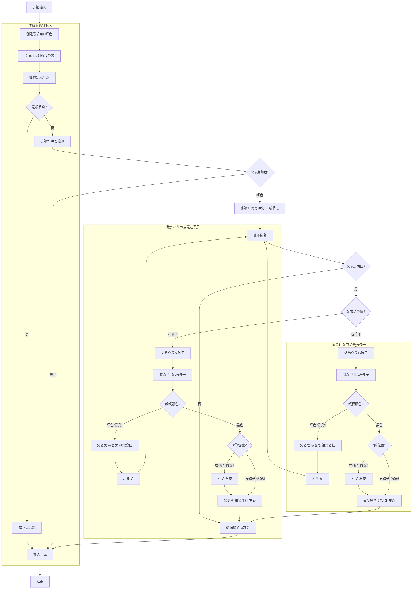

## 口诀
左根右 (满足二叉搜索树的性质)
根叶黑 (根节点和 null节点都是黑色的)
不红红 (相邻父子不会都是红色)
黑路同 (任意一条路径上黑色节点的数目是相同的)

## 红黑树插入完整逻辑梳理（含哨兵节点特化处理）
红黑树插入的核心是「插入节点→触发冲突检测→通过变色/旋转修复」，结合「哨兵节点解决空指针问题」的特化处理，整体逻辑可拆解为 **3大步骤+5种修复情况**（含对称场景），全程严格遵守红黑树5条性质，以下是完整梳理：

## 一、前置准备（代码实现基础）
### 1. 核心约定（含哨兵节点定义）
- **节点结构**（以C++为例，其他语言同理）：
  ```cpp
  struct RBNode {
      int key;          // 键值
      RBNode* left;     // 左孩子
      RBNode* right;    // 右孩子
      RBNode* parent;   // 父节点
      bool is_red;      // 颜色：true=红，false=黑
  };
  ```
- **哨兵节点（Sentinel）**：全局/静态单例，统一表示「不存在的子节点」，避免空指针访问：
  ```cpp
  RBNode* NIL_SENTINEL = new RBNode{
      0,                // 键值无意义
      NIL_SENTINEL,     // 左孩子指向自身
      NIL_SENTINEL,     // 右孩子指向自身
      NIL_SENTINEL,     // 父节点指向自身
      false             // 固定为黑色（符合叶子节点为黑的性质）
  };
  ```
- **红黑树结构**：根节点初始化为 `NIL_SENTINEL`（空树）：
  ```cpp
  struct RBTree {
      RBNode* root = NIL_SENTINEL;
  };
  ```

### 2. 辅助操作（旋转）
修复过程需依赖左旋、右旋（核心是保持二叉搜索树性质，调整节点位置）：
- **左旋**（以节点x为轴，右子树y上位）：
  ```cpp
  void left_rotate(RBTree& tree, RBNode* x) {
      RBNode* y = x->right;       // y是x的右孩子
      x->right = y->left;         // y的左子树挂到x的右子树
      
      if (y->left != NIL_SENTINEL) { // 若y的左子树非哨兵（真实节点），更新父节点
          y->left->parent = x;
      }
      
      y->parent = x->parent;      // y继承x的父节点
      if (x->parent == NIL_SENTINEL) { // x是根节点
          tree.root = y;
      } else if (x == x->parent->left) { // x是左孩子
          x->parent->left = y;
      } else { // x是右孩子
          x->parent->right = y;
      }
      
      y->left = x;                // x作为y的左孩子
      x->parent = y;
  }
  ```
- **右旋**（与左旋对称，以节点y为轴，左子树x上位）：
  ```cpp
  void right_rotate(RBTree& tree, RBNode* y) {
      RBNode* x = y->left;        // x是y的左孩子
      y->left = x->right;         // x的右子树挂到y的左子树
      
      if (x->right != NIL_SENTINEL) { // 若x的右子树非哨兵，更新父节点
          x->right->parent = y;
      }
      
      x->parent = y->parent;      // x继承y的父节点
      if (y->parent == NIL_SENTINEL) { // y是根节点
          tree.root = x;
      } else if (y == y->parent->left) { // y是左孩子
          y->parent->left = x;
      } else { // y是右孩子
          y->parent->right = x;
      }
      
      x->right = y;               // y作为x的右孩子
      y->parent = x;
  }
  ```


## 二、插入完整步骤（3步走）
### 步骤1：按二叉搜索树规则插入新节点（基础插入）
核心是找到新节点的合适位置，初始化节点属性（默认红色），并关联哨兵节点避免空指针。
1. **创建新节点**：键值为目标值，`left`/`right`/`parent` 初始指向 `NIL_SENTINEL`，颜色设为红色（避免直接破坏「黑路径长度」性质）：
   ```cpp
   RBNode* new_node = new RBNode{key, NIL_SENTINEL, NIL_SENTINEL, NIL_SENTINEL, true};
   ```
2. **查找插入位置**：从根节点出发，按BST规则（小于当前节点走左，大于走右）找到叶子位置（最终指向哨兵节点的父节点）：
   ```cpp
   RBNode* parent = NIL_SENTINEL;   // 记录父节点
   RBNode* curr = tree.root;        // 遍历指针
   while (curr != NIL_SENTINEL) {   // 哨兵节点表示遍历到叶子
       parent = curr;
       if (new_node->key < curr->key) {
           curr = curr->left;
       } else if (new_node->key > curr->key) {
           curr = curr->right;
       } else {
           // 键值已存在（根据需求处理：覆盖/忽略/报错）
           delete new_node;
           return;
       }
   }
   ```
3. **挂载新节点**：将新节点作为父节点的左/右孩子，若父节点是哨兵（空树），则新节点成为根：
   ```cpp
   new_node->parent = parent;
   if (parent == NIL_SENTINEL) {
       tree.root = new_node;       // 空树插入，新节点为根
   } else if (new_node->key < parent->key) {
       parent->left = new_node;
   } else {
       parent->right = new_node;
   }
   ```
4. **特殊处理：根节点着色**：若新节点是根（父节点为哨兵），需将颜色改为黑色（满足「根节点为黑」的性质）：
   ```cpp
   if (new_node->parent == NIL_SENTINEL) {
       new_node->is_red = false;
       return;
   }
   ```

### 步骤2：冲突检测（是否需要修复）
新节点默认红色，仅可能违反「红父必黑」性质（其他4条性质均满足）：
- 若新节点的父节点是 **黑色**：无冲突，插入成功，直接返回；
- 若新节点的父节点是 **红色**：触发冲突，进入步骤3（修复流程）。

> 注：父节点是红色时，祖父节点必存在且为黑色（若祖父是红色，父节点也为红色，早在上次插入时已修复，因此祖父节点一定是真实节点，且 `parent->parent != NIL_SENTINEL`）。

### 步骤3：冲突修复（5种情况，含哨兵特化处理）
修复的核心依据：「父节点的位置（祖父的左/右孩子）」+「叔叔节点的颜色（含哨兵=黑色）」+「新节点的位置（父的左/右孩子）」。

#### 前提定义（修复过程中固定）
- 新节点：`z`（当前冲突节点）
- 父节点：`z_parent = z->parent`（红色）
- 祖父节点：`z_grandpa = z_parent->parent`（黑色）
- 叔叔节点：`z_uncle`（祖父的另一个孩子，即 `z_parent` 的兄弟）
  - 若 `z_parent` 是祖父的左孩子：`z_uncle = z_grandpa->right`（可能是真实节点或哨兵）
  - 若 `z_parent` 是祖父的右孩子：`z_uncle = z_grandpa->left`（可能是真实节点或哨兵）

#### 修复情况分类（按父节点位置拆分，对称场景合并说明）
##### 场景A：父节点是祖父的左孩子（`z_parent == z_grandpa->left`）
###### 情况1：叔叔节点是红色（`z_uncle->is_red == true`）
- 触发条件：`z_parent` 红 + `z_uncle` 红（叔叔是真实节点，非哨兵）
- 修复逻辑（仅变色，冲突上移）：
  1. `z_parent->is_red = false`（父节点变黑）；
  2. `z_uncle->is_red = false`（叔叔节点变黑）；
  3. `z_grandpa->is_red = true`（祖父节点变红）；
  4. `z = z_grandpa`（祖父变红后，可能与它的父节点冲突，继续向上检查）。

###### 情况2：叔叔节点是黑色（`z_uncle->is_red == false`），且z是父节点的右孩子（`z == z_parent->right`）
- 触发条件：`z_parent` 红 + `z_uncle` 黑（叔叔是哨兵或真实黑节点）+ z是父右子
- 修复逻辑（先左旋，转化为情况3）：
  1. `z = z_parent`（将z指向父节点，后续旋转父节点）；
  2. 对 `z` 执行左旋（`left_rotate(tree, z)`）；
  3. 转化后进入「情况3」继续修复。

###### 情况3：叔叔节点是黑色（`z_uncle->is_red == false`），且z是父节点的左孩子（`z == z_parent->left`）
- 触发条件：`z_parent` 红 + `z_uncle` 黑（叔叔是哨兵或真实黑节点）+ z是父左子
- 修复逻辑（变色+右旋，一次修复完成）：
  1. `z_parent->is_red = false`（父节点变黑）；
  2. `z_grandpa->is_red = true`（祖父节点变红）；
  3. 对 `z_grandpa` 执行右旋（`right_rotate(tree, z_grandpa)`）；
  4. 修复完成（无需继续向上检查，因祖父变红后，其父节点是黑色，无冲突）。

##### 场景B：父节点是祖父的右孩子（`z_parent == z_grandpa->right`）
与场景A对称，仅需替换「左/右」和「左旋/右旋」，核心逻辑一致：

###### 情况4：叔叔节点是红色（`z_uncle->is_red == true`）
- 修复逻辑：父节点变黑 + 叔叔节点变黑 + 祖父节点变红 + `z = z_grandpa`（冲突上移）。

###### 情况5：叔叔节点是黑色（`z_uncle->is_red == false`），且z是父节点的左孩子（`z == z_parent->left`）
- 修复逻辑：`z = z_parent` → 对 `z` 执行右旋 → 转化为情况5。

###### 情况6：叔叔节点是黑色（`z_uncle->is_red == false`），且z是父节点的右孩子（`z == z_parent->right`）
- 修复逻辑：父节点变黑 + 祖父节点变红 → 对 `z_grandpa` 执行左旋 → 修复完成。

> 哨兵特化处理说明：当叔叔节点不存在时，`z_uncle == NIL_SENTINEL`，而哨兵的 `is_red = false`，因此直接归入「叔叔是黑色」的情况（情况2、3、5、6），无需额外判断空指针，代码自然兼容。

#### 修复流程终止条件
- 循环修复直到 `z->parent->is_red == false`（父节点为黑，无冲突）；
- 每次修复后，需确保根节点始终为黑色（最后执行 `tree.root->is_red = false`，避免祖父变红后根节点为红）。


## 三、完整代码片段（整合所有逻辑）
```cpp
// 插入修复函数（内部调用）
void rb_insert_fixup(RBTree& tree, RBNode* z) {
    while (z->parent->is_red) { // 父节点为红，触发冲突
        if (z->parent == z->parent->parent->left) { // 父是祖父左孩子（场景A）
            RBNode* z_uncle = z->parent->parent->right; // 叔叔是祖父右孩子
            
            if (z_uncle->is_red) { // 情况1：叔叔红色
                z->parent->is_red = false;
                z_uncle->is_red = false;
                z->parent->parent->is_red = true;
                z = z->parent->parent; // 冲突上移
            } else { // 叔叔黑色（含哨兵）
                if (z == z->parent->right) { // 情况2：z是父右子
                    z = z->parent;
                    left_rotate(tree, z);
                }
                // 情况3：z是父左子
                z->parent->is_red = false;
                z->parent->parent->is_red = true;
                right_rotate(tree, z->parent->parent);
            }
        } else { // 父是祖父右孩子（场景B，对称）
            RBNode* z_uncle = z->parent->parent->left; // 叔叔是祖父左孩子
            
            if (z_uncle->is_red) { // 情况4：叔叔红色
                z->parent->is_red = false;
                z_uncle->is_red = false;
                z->parent->parent->is_red = true;
                z = z->parent->parent; // 冲突上移
            } else { // 叔叔黑色（含哨兵）
                if (z == z->parent->left) { // 情况5：z是父左子
                    z = z->parent;
                    right_rotate(tree, z);
                }
                // 情况6：z是父右子
                z->parent->is_red = false;
                z->parent->parent->is_red = true;
                left_rotate(tree, z->parent->parent);
            }
        }
        tree.root->is_red = false; // 确保根节点为黑
    }
}

// 对外暴露的插入函数
void rb_insert(RBTree& tree, int key) {
    // 步骤1：创建新节点（默认红色，关联哨兵）
    RBNode* new_node = new RBNode{key, NIL_SENTINEL, NIL_SENTINEL, NIL_SENTINEL, true};
    
    // 步骤1：查找插入位置
    RBNode* parent = NIL_SENTINEL;
    RBNode* curr = tree.root;
    while (curr != NIL_SENTINEL) {
        parent = curr;
        if (new_node->key < curr->key) {
            curr = curr->left;
        } else if (new_node->key > curr->key) {
            curr = curr->right;
        } else {
            delete new_node; // 键值重复，直接返回
            return;
        }
    }
    
    // 步骤1：挂载新节点
    new_node->parent = parent;
    if (parent == NIL_SENTINEL) {
        tree.root = new_node; // 空树插入，新节点为根
    } else if (new_node->key < parent->key) {
        parent->left = new_node;
    } else {
        parent->right = new_node;
    }
    
    // 步骤1：根节点特殊处理（设为黑色）
    if (new_node->parent == NIL_SENTINEL) {
        new_node->is_red = false;
        return;
    }
    
    // 步骤2：冲突检测（父节点为红则修复）
    rb_insert_fixup(tree, new_node);
}
```


## 四、核心逻辑总结
1. **哨兵节点是关键**：统一处理「节点不存在」的边界情况，避免空指针访问，同时天然满足「叶子节点为黑」的性质；
2. **插入流程极简**：先按BST规则插入（新节点红），仅当「父节点为红」时触发修复；
3. **修复逻辑分两类**：
   - 叔叔红色：仅变色，冲突上移（本质是将红色冲突传递给祖父，避免父、子、叔同红）；
   - 叔叔黑色：先通过旋转将「非斜链」转化为「斜链」，再通过变色+反向旋转彻底修复；
4. **对称场景复用**：父节点是祖父的左/右孩子，逻辑完全对称，仅需替换旋转方向和孩子位置判断；
5. **时间复杂度**：插入和修复均为 O(log n)（树高为 log n，修复最多旋转2次/层）。

通过以上逻辑，红黑树插入过程既能严格维持5条性质，又能通过哨兵节点简化代码，避免空指针等边界错误。

---

好的，我来调整成中文版本，同时确保语法正确：



**红黑树插入流程详解：**

## 流程图解读

### 第一步：BST基础插入
1. **创建节点**：新节点默认为红色
2. **查找位置**：按照二叉搜索树规则找到插入位置
3. **挂载节点**：将新节点连接到父节点
4. **根节点处理**：如果是根节点，直接染黑后结束

### 第二步：冲突检测
- **父节点为黑**：没有违反红黑树性质，直接结束
- **父节点为红**：违反"不红红"原则，进入修复流程

### 第三步：修复冲突（循环处理）

#### 场景A：父节点是祖父的左孩子
- **情况1（叔叔红色）**：
  - 操作：父变黑 + 叔变黑 + 祖父变红
  - 结果：冲突上移到祖父节点，继续循环
- **情况2（叔叔黑色，z是右孩子）**：
  - 操作：左旋父节点，转为情况3
- **情况3（叔叔黑色，z是左孩子）**：
  - 操作：父变黑 + 祖父变红 + 右旋祖父
  - 结果：修复完成，退出循环

#### 场景B：父节点是祖父的右孩子（对称情况）
- **情况4（叔叔红色）**：同情况1，对称处理
- **情况5（叔叔黑色，z是左孩子）**：右旋父节点，转为情况6
- **情况6（叔叔黑色，z是右孩子）**：父变黑 + 祖父变红 + 左旋祖父

### 循环终止条件
1. 父节点变为黑色
2. 每次循环后确保根节点为黑色
3. 情况1/4会让冲突上移继续处理，情况3/6直接修复完成

### 哨兵节点处理
- 叔叔节点为哨兵时，颜色为黑色
- 所有空指针访问都通过哨兵节点避免
- 简化了边界条件的判断

这个流程图清晰展示了红黑树插入的所有6种修复情况（3种基本+3种对称）以及循环修复的逻辑。